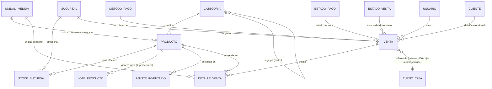

# Modelo de Datos: Core de Ventas e Inventario

**Feature**: `001-core-ventas-inventario` | **Fecha**: 2026-09-04
**Origen**: `spec.md` (entidades clave) + `research.md` (Decisiones 1-4)

## Diagrama de relaciones

`SUCURSAL` y `USUARIO` son propiedad de Expansión y Sucursales / Administración; `CLIENTE` de `002-clientes-fidelizacion`; `TURNO_CAJA` de `006-caja-mermas-fraude` — este módulo solo lo referencia por FK, nunca lo escribe (Decisión 2).

## Catálogos maestros *(añadidos en enmienda v1.3 — normalización de catálogos)*

Los cuatro catálogos de vocabulario cerrado usan **clave natural** (`codigo VARCHAR` como PK), no `SERIAL`: el dato guardado en la tabla que los referencia sigue siendo legible sin JOIN, la lógica de los servicios que compara contra el código no cambia, y la migración no reescribe ninguna fila existente. `categoria` es la excepción: lleva `id BIGSERIAL` porque necesita autorreferencia jerárquica y sus nombres los edita el negocio.

Todos se poblan con `INSERT` de seed **dentro de la misma migración Alembic** que los crea (T037): un catálogo vacío rompe la FK de la tabla que lo usa y deja el sistema sin arrancar.

### `categoria`

| Campo | Tipo | Restricciones |
|---|---|---|
| id | BIGSERIAL | PK |
| nombre | VARCHAR(60) | NOT NULL, UNIQUE |
| categoria_padre_id | BIGINT | NULL, FK → categoria, CHECK (categoria_padre_id <> id) — RN-CVI-007 |
| es_perecedero | BOOLEAN | NOT NULL, DEFAULT false — valor por defecto que hereda el producto al crearse |
| activo | BOOLEAN | NOT NULL, DEFAULT true |

Jerarquía de **dos niveles como máximo** (Bebidas → Gaseosas): una categoría cuyo padre ya tiene padre se rechaza (RN-CVI-008). El límite es deliberado — permite agregar informes de OT1.1/OT2.1/OT3.2 en ambos niveles sin necesitar consultas recursivas.

`es_perecedero` aquí es el **valor por defecto** que se aplica a `producto.es_perecedero` al crear el producto, no una regla que lo sobreescriba: dentro de "Lácteos" (perecedera) puede existir leche en polvo, que no lo es. El campo del producto sigue mandando.

Seed inicial: Bebidas, Snacks, Lácteos, Abarrotes, Limpieza, Cuidado Personal, Panadería, Congelados.

### `unidad_medida`

| Campo | Tipo | Restricciones |
|---|---|---|
| codigo | VARCHAR(20) | PK — `'unidad'`, `'libra'`, `'kilo'`, `'litro'`, `'funda'`, `'caja'` |
| etiqueta | VARCHAR(80) | NOT NULL |
| permite_decimales | BOOLEAN | NOT NULL, DEFAULT false |
| orden | SMALLINT | NOT NULL, DEFAULT 0 |
| activo | BOOLEAN | NOT NULL, DEFAULT true |

`permite_decimales` es el que da valor real al catálogo: el arroz se vende en libras con decimales, una gaseosa no se vende en 0.5 unidades. Habilita RN-CVI-006, que bloquea la incoherencia antes de que el cajero la cometa (OT3.8).

### `metodo_pago`

| Campo | Tipo | Restricciones |
|---|---|---|
| codigo | VARCHAR(20) | PK — `'efectivo'`, `'tarjeta'`, `'electronico'` |
| etiqueta | VARCHAR(80) | NOT NULL |
| es_electronico | BOOLEAN | NOT NULL |
| orden | SMALLINT | NOT NULL, DEFAULT 0 |
| activo | BOOLEAN | NOT NULL, DEFAULT true |

`es_electronico` deja el KPI de adopción de pago electrónico de OT2.2 como un `WHERE es_electronico` en lugar de enumerar códigos en cada consulta e informe.

### `estado_pago`

| Campo | Tipo | Restricciones |
|---|---|---|
| codigo | VARCHAR(20) | PK — `'pendiente'`, `'aprobado'`, `'rechazado'` |
| etiqueta | VARCHAR(80) | NOT NULL |
| es_estado_final | BOOLEAN | NOT NULL |
| orden | SMALLINT | NOT NULL, DEFAULT 0 |
| activo | BOOLEAN | NOT NULL, DEFAULT true |

### `estado_venta`

| Campo | Tipo | Restricciones |
|---|---|---|
| codigo | VARCHAR(20) | PK — `'completada'`, `'anulada'` |
| etiqueta | VARCHAR(80) | NOT NULL |
| cuenta_para_ingresos | BOOLEAN | NOT NULL |
| orden | SMALLINT | NOT NULL, DEFAULT 0 |
| activo | BOOLEAN | NOT NULL, DEFAULT true |

`cuenta_para_ingresos` es la regla de negocio que hoy vive repetida como un `WHERE estado_venta <> 'anulada'` en cada consulta de ventas: una venta anulada no suma al margen de OT1.1 ni al ticket promedio de OT1.4. Al ser un dato, el ETL de `011-analitica-reportes` la aplica sin duplicar la lógica.

## Tablas

### `producto`

| Campo | Tipo | Restricciones |
|---|---|---|
| id | BIGSERIAL | PK |
| nombre | TEXT | NOT NULL |
| categoria_id | BIGINT | NOT NULL, FK → categoria — *enmienda v1.3, antes era `categoria TEXT`* |
| codigo_barras | TEXT | NULL, UNIQUE |
| unidad_venta_codigo | VARCHAR(20) | NOT NULL, FK → unidad_medida — *enmienda v1.3, antes era `unidad_venta TEXT`* |
| unidad_inventario_codigo | VARCHAR(20) | NOT NULL, FK → unidad_medida — *enmienda v1.3, antes era `unidad_inventario TEXT`* |
| es_fraccionable | BOOLEAN | NOT NULL, DEFAULT false |
| factor_conversion | NUMERIC(10,4) | NULL, CHECK (es_fraccionable = false OR factor_conversion IS NOT NULL) — RN-CVI-001 |
| es_perecedero | BOOLEAN | NOT NULL, DEFAULT false — se precarga desde `categoria.es_perecedero` al crear, pero el producto manda |
| activo | BOOLEAN | NOT NULL, DEFAULT true |
| creado_en | TIMESTAMPTZ | NOT NULL, DEFAULT now() |

Índice: `(categoria_id)` — soporta las agregaciones por categoría de OT1.1, OT2.1 y OT3.2.

### `stock_sucursal`

| Campo | Tipo | Restricciones |
|---|---|---|
| id | BIGSERIAL | PK |
| producto_id | BIGINT | NOT NULL, FK → producto |
| sucursal_id | BIGINT | NOT NULL, FK → sucursal |
| cantidad_disponible | NUMERIC(10,3) | NOT NULL, DEFAULT 0, CHECK (cantidad_disponible >= 0) — RN-CVI-002 |
| dias_sin_venta | INTEGER | NOT NULL, DEFAULT 0 |
| marcado_sin_rotacion | BOOLEAN | NOT NULL, DEFAULT false |
| stock_minimo | NUMERIC(10,3) | NOT NULL, DEFAULT 0, CHECK (stock_minimo >= 0) — RN-CVI-005, enmienda v1.2 |
| actualizado_en | TIMESTAMPTZ | NOT NULL, DEFAULT now() |

Restricción: único `(producto_id, sucursal_id)`.

### `lote_producto`

| Campo | Tipo | Restricciones |
|---|---|---|
| id | BIGSERIAL | PK |
| producto_id | BIGINT | NOT NULL, FK → producto |
| sucursal_id | BIGINT | NOT NULL, FK → sucursal |
| fecha_caducidad | DATE | NOT NULL |
| cantidad_lote | NUMERIC(10,3) | NOT NULL, CHECK (cantidad_lote > 0) |
| cantidad_restante | NUMERIC(10,3) | NOT NULL, CHECK (cantidad_restante >= 0 AND cantidad_restante <= cantidad_lote) |
| fecha_ingreso | TIMESTAMPTZ | NOT NULL, DEFAULT now() |
| retirado_en | TIMESTAMPTZ | NULL |
| motivo_retiro | TEXT | NULL |

### `ajuste_inventario`

| Campo | Tipo | Restricciones |
|---|---|---|
| id | BIGSERIAL | PK |
| producto_id | BIGINT | NOT NULL, FK → producto |
| sucursal_id | BIGINT | NOT NULL, FK → sucursal |
| cantidad_ajuste | NUMERIC(10,3) | NOT NULL |
| motivo | TEXT | NOT NULL, CHECK (length(motivo) >= 3) |
| usuario_id | BIGINT | NOT NULL, FK → usuario |
| fecha | TIMESTAMPTZ | NOT NULL, DEFAULT now() |

### `venta`

| Campo | Tipo | Restricciones |
|---|---|---|
| id | BIGSERIAL | PK |
| numero_documento | TEXT | GENERATED ALWAYS AS ('V-' \|\| lpad(id::text, 8, '0')) STORED, UNIQUE — RF-CVI-020, enmienda v1.2 (nota de venta interna, no un comprobante certificado SRI) |
| sucursal_id | BIGINT | NOT NULL, FK → sucursal |
| turno_caja_id | BIGINT | NOT NULL, FK → turno_caja (externa, `006-caja-mermas-fraude`) |
| cajero_id | BIGINT | NOT NULL, FK → usuario |
| cliente_id | BIGINT | NULL, FK → cliente (`002-clientes-fidelizacion`) |
| hora_inicio_cobro | TIMESTAMPTZ | NULL — opcional (RF-CVI-017, enmienda v1.1); permite calcular `fecha_hora - hora_inicio_cobro` como duración real del cobro para el KPI de OT2.2 (<90 seg) |
| fecha_hora | TIMESTAMPTZ | NOT NULL, DEFAULT now() |
| subtotal | NUMERIC(10,2) | NOT NULL, CHECK (subtotal >= 0) |
| descuento_aplicado | NUMERIC(10,2) | NOT NULL, DEFAULT 0 |
| iva | NUMERIC(10,2) | NOT NULL — 15% sobre (subtotal − descuento_aplicado), Art. 4.1 |
| total | NUMERIC(10,2) | NOT NULL, CHECK (total = subtotal − descuento_aplicado + iva) |
| metodo_pago | VARCHAR(20) | NOT NULL, FK → metodo_pago(codigo) — *enmienda v1.3, antes era CHECK IN (...)* |
| estado_pago | VARCHAR(20) | NOT NULL, DEFAULT 'pendiente', FK → estado_pago(codigo) — *enmienda v1.3* |
| estado_venta | VARCHAR(20) | NOT NULL, DEFAULT 'completada', FK → estado_venta(codigo) — *enmienda v1.3* |
| motivo_anulacion | TEXT | NULL, CHECK (estado_venta <> 'anulada' OR motivo_anulacion IS NOT NULL) |
| anulada_en | TIMESTAMPTZ | NULL |
| datafono_id | BIGINT | NULL, FK → datafono (externa, `007-pagos-seguridad`, **no diferida** — enmienda v1.5) |

Restricción adicional *(enmienda v1.5)*: **CHECK** `(metodo_pago <> 'efectivo' OR datafono_id IS NULL)` — RN-CVI-011, mitad de la regla expresable a nivel de una sola fila. La otra mitad (obligatorio para tarjeta/electrónico si la sucursal tiene un datáfono activo) depende de otra tabla y se valida en el router.

Índices: `(sucursal_id, fecha_hora)`, `(turno_caja_id)`, `(datafono_id)` *(enmienda v1.5)*.

### `detalle_venta`

| Campo | Tipo | Restricciones |
|---|---|---|
| id | BIGSERIAL | PK |
| venta_id | BIGINT | NOT NULL, FK → venta |
| producto_id | BIGINT | NOT NULL, FK → producto |
| cantidad_venta | NUMERIC(10,3) | NOT NULL, CHECK (cantidad_venta > 0) |
| unidad_venta_codigo | VARCHAR(20) | NOT NULL, FK → unidad_medida — snapshot con integridad referencial (*enmienda v1.3*) |
| cantidad_inventario | NUMERIC(10,3) | NOT NULL — ya convertida vía `factor_conversion` |
| precio_unitario_aplicado | NUMERIC(10,2) | NOT NULL — snapshot |
| subtotal_item | NUMERIC(10,2) | NOT NULL, CHECK (subtotal_item = cantidad_venta × precio_unitario_aplicado) |

### `producto_sustituto` *(añadida en enmienda v1.1, auditoría enunciado-vs-specs)*

| Campo | Tipo | Restricciones |
|---|---|---|
| id | BIGSERIAL | PK |
| producto_id | BIGINT | NOT NULL, FK → producto |
| producto_sustituto_id | BIGINT | NOT NULL, FK → producto, CHECK (producto_sustituto_id <> producto_id) — RN-CVI-004 |
| activo | BOOLEAN | NOT NULL, DEFAULT true |
| creado_en | TIMESTAMPTZ | NOT NULL, DEFAULT now() |

Restricción: único `(producto_id, producto_sustituto_id)`. Relación dirigida: si la sustitución es de doble vía (p. ej. dos marcas de arroz intercambiables), el servicio inserta las dos filas `(A,B)` y `(B,A)` al registrar con `simetrico=true` (ver `contracts/`) — la tabla en sí no asume simetría, para poder modelar también sustituciones de una sola vía (p. ej. una presentación grande sustituye a una chica, pero no al revés). Consumida por `004-pronostico-demanda` para registrar si se ofreció/aceptó un sustituto ante un quiebre de stock (ver Decisión de `004-pronostico-demanda/research.md`).

### `anaquel` *(añadida en enmienda v1.4, auditoría de riesgos derivados)*

| Campo | Tipo | Restricciones |
|---|---|---|
| id | BIGINT | PK |
| sucursal_id | BIGINT | NOT NULL, FK → sucursal |
| codigo | VARCHAR(20) | NOT NULL |
| descripcion | VARCHAR(200) | NULL |
| capacidad_maxima | INTEGER | NULL — sin límite declarado; CHECK (capacidad_maxima IS NULL OR capacidad_maxima > 0) |
| activo | BOOLEAN | NOT NULL, DEFAULT true |
| creado_en | TIMESTAMPTZ | NOT NULL, DEFAULT now() |

Restricción: único `(sucursal_id, codigo)`.

### `producto_ubicacion` *(añadida en enmienda v1.4)*

| Campo | Tipo | Restricciones |
|---|---|---|
| id | BIGINT | PK |
| producto_id | BIGINT | NOT NULL, FK → producto |
| sucursal_id | BIGINT | NOT NULL, FK → sucursal |
| anaquel_id | BIGINT | NOT NULL, FK → anaquel |
| asignado_por | BIGINT | NOT NULL, FK → usuario |
| actualizado_en | TIMESTAMPTZ | NOT NULL, DEFAULT now() |

Restricción: único `(producto_id, sucursal_id)` — un producto tiene una sola ubicación vigente por sucursal, sin historial (Decisión 8 de `research.md`). RN-CVI-010: asignar por encima de `anaquel.capacidad_maxima` se rechaza con `409`.

## Notas de integridad transversales

- Ninguna tabla de este módulo permite `DELETE` desde la aplicación (RNF-CVI-002). *(Enmienda v1.3)* Esto se extiende a los cinco catálogos: se dan de baja con `activo = false`, nunca se borran — si se borrara una fila referenciada, el historial de ventas perdería el significado de su propio snapshot.
- `detalle_venta.precio_unitario_aplicado` y `unidad_venta_codigo` son snapshots deliberados (RN-CVI-003) — el historial de ventas nunca cambia si el catálogo cambia después. *(Enmienda v1.3)* `unidad_venta_codigo` ahora es además FK: sigue siendo snapshot (guarda la unidad **con la que se vendió**, aunque el producto cambie de unidad después), pero ya no puede contener un valor que no exista en el catálogo.
- `venta.turno_caja_id` y `alerta_fraude_pago` (que antes vivía junto a `venta`) ahora están en módulos distintos — este módulo nunca abre, cierra ni consulta el detalle de un turno, solo guarda la referencia.
- *(Enmienda v1.2)* `numero_documento` es una columna `GENERATED` derivada del propio `id` — no requiere un contador ni una tabla de correlativos nueva, y su unicidad queda garantizada por la del `id` que la genera.
- *(Enmienda v1.3)* Coherencia entre `producto.es_fraccionable` y la unidad: un producto fraccionable exige que su `unidad_venta_codigo` tenga `permite_decimales = true` (RN-CVI-006). Es la contraparte de RN-CVI-001: esa regla obliga a tener `factor_conversion`, esta obliga a que la unidad admita el decimal que ese factor produce. Sin ambas, se puede crear un producto "fraccionable en unidades", que no significa nada.
- *(Enmienda v1.3)* Ninguna de las cinco tablas de catálogo lleva `creado_en`/`actualizado_en`: son vocabulario del sistema con seed en la migración, no hechos del negocio. Auditar su modificación es responsabilidad del `log_auditoria` de `010-administracion`, no de columnas propias.
- *(Enmienda v1.5)* `venta.datafono_id` es solo el dato crudo — este módulo nunca consulta `revision_datafono` ni calcula si un datáfono estaba conforme. Esa lectura cruzada (`venta` desde `007-pagos-seguridad`) vive en `GET /pagos/datafonos/{id}/ventas`, dueño de la pregunta "¿este terminal estuvo conforme?" — mismo principio de responsabilidad ya aplicado en Decisión 9 de `research.md`.
