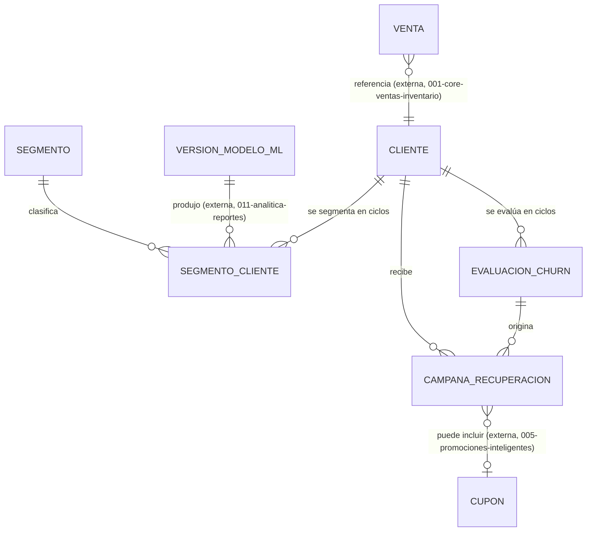

# Modelo de Datos: Clientes y Fidelización

**Feature**: `002-clientes-fidelizacion` | **Fecha**: 2026-09-04
**Origen**: `spec.md` (entidades clave) + `research.md` (Decisiones 1-3)

## Diagrama de relaciones

`VENTA` es propiedad de `001-core-ventas-inventario`; `CUPON` de `005-promociones-inteligentes` — ambas solo se referencian por FK.

## Catálogo maestro *(añadido en enmienda v1.1 — normalización de catálogos)*

### `segmento`

| Campo | Tipo | Restricciones |
|---|---|---|
| codigo | VARCHAR(40) | PK — `'leal_alto_margen'`, `'frecuente_bajo_margen'`, `'ocasional'`, `'nuevo'`, `'en_riesgo'` |
| etiqueta | VARCHAR(80) | NOT NULL |
| descripcion | TEXT | NOT NULL — qué caracteriza al segmento según el modelo de segmentación |
| prioridad_comercial | SMALLINT | NOT NULL, CHECK (prioridad_comercial BETWEEN 1 AND 10) |
| orden | SMALLINT | NOT NULL, DEFAULT 0 |
| activo | BOOLEAN | NOT NULL, DEFAULT true |

Clave natural (`codigo VARCHAR`), igual que los catálogos de `001-core-ventas-inventario`: el valor guardado en `segmento_cliente` sigue siendo legible sin JOIN.

`prioridad_comercial` es el atributo que justifica el catálogo: cuando `005-promociones-inteligentes` tiene presupuesto limitado de cupones, necesita saber a qué segmento atender primero (OT2.3). Hoy ese orden no existe en ninguna parte — habría que decidirlo en el código de la campaña, quemado.

Los cinco códigos del seed son los nombres de negocio de los clusters, no los números que devuelve el algoritmo: el modelo de segmentación produce clusters `0..k-1` sin significado, y es el servicio de `011-analitica-reportes` el que los mapea a estos códigos al publicar una versión del modelo. Esa traducción es justamente lo que hace legible el resultado del K-Means para el resto del sistema.

## Tablas

### `cliente`

| Campo | Tipo | Restricciones |
|---|---|---|
| id | BIGSERIAL | PK |
| nombre | TEXT | NOT NULL |
| contacto | TEXT | NULL |
| fecha_nacimiento | DATE | NULL |
| creado_en | TIMESTAMPTZ | NOT NULL, DEFAULT now() |

Índices: `(fecha_nacimiento)` — usado por `005-promociones-inteligentes` para cupones de cumpleaños.

### `segmento_cliente`

| Campo | Tipo | Restricciones |
|---|---|---|
| id | BIGSERIAL | PK |
| cliente_id | BIGINT | NOT NULL, FK → cliente |
| segmento_codigo | VARCHAR(40) | NOT NULL, FK → segmento(codigo) — *enmienda v1.1, antes era `segmento TEXT` libre* |
| frecuencia_snapshot | NUMERIC(10,2) | NULL |
| margen_snapshot | NUMERIC(10,2) | NULL |
| recencia_dias_snapshot | INTEGER | NULL |
| tamano_muestra | INTEGER | NOT NULL, CHECK (tamano_muestra > 0) |
| periodo_inicio | DATE | NOT NULL |
| periodo_fin | DATE | NOT NULL |
| version_modelo_id | BIGINT | NOT NULL, FK → version_modelo_ml (externa, `011-analitica-reportes`) — *enmienda v1.1* |
| fecha_calculo | TIMESTAMPTZ | NOT NULL, DEFAULT now() |
| vigente_hasta | TIMESTAMPTZ | NULL — NULL = asignación vigente; *enmienda v1.1* |

Índices: `(cliente_id, fecha_calculo DESC)`.

Restricción adicional *(enmienda v1.1)*: **índice único parcial** `UNIQUE (cliente_id) WHERE vigente_hasta IS NULL` — un cliente no puede tener dos segmentos vigentes a la vez. Mismo patrón de índice parcial que ya usan `recomendacion_precio` en `003-precios-margenes` y `turno_caja` en `006-caja-mermas-fraude`: un solo registro "activo" permitido por clave.

**Esta tabla ES la dimensión SCD tipo 2 de cliente** *(enmienda v1.1)*. Ya era append-only desde el diseño original, así que la historia siempre existió; lo que le faltaba era poder leerla como dimensión versionada. Con `fecha_calculo` como `fecha_desde` y `vigente_hasta` explícito, el ETL de `011-analitica-reportes` construye `dim_cliente` leyendo el rango directo, en lugar de deducirlo con una función de ventana `LEAD(fecha_calculo)` sobre toda la tabla. **No se crea una tabla de historia aparte**: duplicaría exactamente esta información y habría que mantener las dos sincronizadas.

**Por qué `version_modelo_id` es obligatorio**: cuando el modelo de segmentación se reentrena y reclasifica a media clientela de un día para otro, hay que poder responder si eso lo causó el modelo nuevo o un cambio real de comportamiento del cliente. Sin esa FK esa pregunta no tiene respuesta, y una reclasificación masiva se leería como si todos los clientes hubieran cambiado de hábitos el mismo día. Es la conexión formal entre este módulo y `011-analitica-reportes`.

### `evaluacion_churn`

| Campo | Tipo | Restricciones |
|---|---|---|
| id | BIGSERIAL | PK |
| cliente_id | BIGINT | NOT NULL, FK → cliente |
| es_riesgo_real | BOOLEAN | NOT NULL |
| dias_sin_compra_al_momento | INTEGER | NOT NULL, CHECK (>= 0) |
| frecuencia_historica_dias | NUMERIC(10,2) | NULL |
| justificacion | TEXT | NOT NULL, CHECK (length(justificacion) >= 10) |
| tamano_muestra | INTEGER | NOT NULL, CHECK (tamano_muestra > 0) |
| fecha_evaluacion | TIMESTAMPTZ | NOT NULL, DEFAULT now() |

Índices: `(cliente_id, fecha_evaluacion DESC)`.

### `campana_recuperacion`

| Campo | Tipo | Restricciones |
|---|---|---|
| id | BIGSERIAL | PK |
| cliente_id | BIGINT | NOT NULL, FK → cliente |
| evaluacion_churn_id | BIGINT | NOT NULL, FK → evaluacion_churn |
| cupon_id | BIGINT | NULL, FK → cupon (externa, `005-promociones-inteligentes`) |
| fecha_envio | TIMESTAMPTZ | NOT NULL, DEFAULT now() |
| usuario_id | BIGINT | NOT NULL, FK → usuario |

**Regla de negocio aplicada (RN-CF-001):** el servicio consulta `venta` (`001-core-ventas-inventario`) buscando alguna compra con `fecha_hora > evaluacion_churn.fecha_evaluacion` antes de insertar — si existe, rechaza con `409`.

## Notas de integridad transversales

- `segmento_cliente`/`evaluacion_churn` son estrictamente append-only (RNF-CF-001). *(Enmienda v1.1)* El único `UPDATE` admitido sobre `segmento_cliente` es cerrar la vigencia de la fila anterior (`vigente_hasta`) en la misma transacción que inserta la nueva — no altera ningún dato del cálculo ya registrado, solo marca hasta cuándo estuvo vigente. Cualquier otro `UPDATE` sigue prohibido.
- *(Enmienda v1.1)* `segmento` no se borra nunca; se da de baja con `activo = false`. Borrar un segmento dejaría sin significado las asignaciones históricas que lo referencian, que es justamente lo que la dimensión SCD tipo 2 existe para preservar.
- Este módulo nunca escribe en `venta`/`detalle_venta` ni en `cupon` — ambas son lecturas o referencias externas (RNF-CF-002, Decisión 1).
