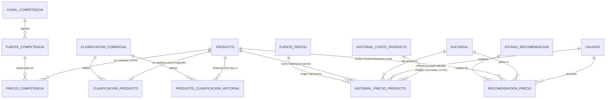

# Modelo de Datos: Precios y Márgenes

**Feature**: `003-precios-margenes` | **Fecha**: 2026-09-04
**Origen**: `spec.md` (entidades clave) + `research.md` (Decisiones 1-3)

## Diagrama de relaciones

`PRODUCTO` es propiedad de `001-core-ventas-inventario`; `HISTORIAL_COSTO_PRODUCTO` es propiedad de `008-compras-proveedores` — este módulo lo consulta para calcular el margen real, pero nunca lo modifica. `SUCURSAL` y `USUARIO` son propiedad de Expansión y Sucursales / Administración (módulos aún no construidos bajo esta estructura).

## Catálogos maestros *(añadidos en enmienda v1.2 — normalización de catálogos)*

Clave natural (`codigo VARCHAR` como PK) en los cuatro, igual que en `001-core-ventas-inventario`. Seed dentro de la misma migración que los crea.

### `clasificacion_comercial`

| Campo | Tipo | Restricciones |
|---|---|---|
| codigo | VARCHAR(40) | PK — `'gancho'`, `'nicho'` |
| etiqueta | VARCHAR(80) | NOT NULL |
| margen_objetivo_min | NUMERIC(5,2) | NOT NULL, CHECK (margen_objetivo_min >= 0) |
| margen_objetivo_max | NUMERIC(5,2) | NOT NULL, CHECK (margen_objetivo_max > margen_objetivo_min) |
| orden | SMALLINT | NOT NULL, DEFAULT 0 |
| activo | BOOLEAN | NOT NULL, DEFAULT true |

El par `margen_objetivo_min`/`margen_objetivo_max` es lo que justifica el catálogo: el rango de margen esperado de un producto gancho (bajo, alta rotación) frente a uno nicho (alto) deja de estar quemado en el código del motor de pricing y pasa a ser un parámetro que el negocio ajusta (OT1.1). Sin esto, cambiar la política de márgenes exigía tocar el código.

### `fuente_precio`

| Campo | Tipo | Restricciones |
|---|---|---|
| codigo | VARCHAR(40) | PK — `'manual'`, `'motor_dinamico'` |
| etiqueta | VARCHAR(80) | NOT NULL |
| requiere_justificacion | BOOLEAN | NOT NULL |
| orden | SMALLINT | NOT NULL, DEFAULT 0 |
| activo | BOOLEAN | NOT NULL, DEFAULT true |

`requiere_justificacion` traduce el Art. 5.9 a un dato: un precio propuesto por el motor debe explicar qué factores consideró; uno fijado a mano por el encargado, no. Hoy esa distinción está implícita en dos ramas del servicio.

### `canal_competencia`

| Campo | Tipo | Restricciones |
|---|---|---|
| codigo | VARCHAR(40) | PK — `'tienda_fisica'`, `'supermercado'`, `'canal_digital'` |
| etiqueta | VARCHAR(80) | NOT NULL |
| frecuencia_monitoreo_dias | SMALLINT | NOT NULL, CHECK (frecuencia_monitoreo_dias > 0) |
| orden | SMALLINT | NOT NULL, DEFAULT 0 |
| activo | BOOLEAN | NOT NULL, DEFAULT true |

`frecuencia_monitoreo_dias` reconoce que los canales no se mueven al mismo ritmo: un canal digital cambia precios a diario, la tienda de la esquina se revisa cada semana. Permite detectar observaciones vencidas (OT2.1) en vez de tratar toda observación como igual de fresca.

### `fuente_competencia`

| Campo | Tipo | Restricciones |
|---|---|---|
| id | BIGSERIAL | PK |
| nombre | VARCHAR(120) | NOT NULL, UNIQUE — p. ej. "Supermercado La Favorita — Quevedo centro" |
| canal_codigo | VARCHAR(40) | NOT NULL, FK → canal_competencia |
| activo | BOOLEAN | NOT NULL, DEFAULT true |

Lleva `id SERIAL` y no clave natural por la misma razón que `categoria` en `001`: el nombre lo escribe y corrige el negocio, y un local puede renombrarse sin que eso deba propagarse a todas las observaciones históricas.

Este catálogo convierte una pregunta hoy imposible en una consulta directa: **"¿contra qué competidor estoy peor de precio?"**. Antes, cada observación escribía el nombre del local a mano, así que dos registros del mismo supermercado con distinta redacción se contaban como competidores distintos. Con el catálogo, `tipo_canal` deja de ser el único eje de análisis de OT2.1 — se puede bajar hasta el local concreto.

### `estado_recomendacion`

| Campo | Tipo | Restricciones |
|---|---|---|
| codigo | VARCHAR(40) | PK — `'pendiente'`, `'aceptada'`, `'rechazada'`, `'obsoleta'` |
| etiqueta | VARCHAR(80) | NOT NULL |
| es_estado_final | BOOLEAN | NOT NULL |
| orden | SMALLINT | NOT NULL, DEFAULT 0 |
| activo | BOOLEAN | NOT NULL, DEFAULT true |

## Tablas

### `historial_precio_producto`

| Campo | Tipo | Restricciones |
|---|---|---|
| id | BIGSERIAL | PK |
| producto_id | BIGINT | NOT NULL, FK → producto |
| sucursal_id | BIGINT | NOT NULL, FK → sucursal |
| precio_venta | NUMERIC(10,2) | NOT NULL, CHECK (precio_venta >= 0) |
| fuente | VARCHAR(40) | NOT NULL, FK → fuente_precio(codigo) — *enmienda v1.2, antes era CHECK IN (...)* |
| vigente_desde | TIMESTAMPTZ | NOT NULL, DEFAULT now() |
| registrado_por | BIGINT | NOT NULL, FK → usuario — quien hizo el cambio manual, o quien aceptó la recomendación |

Índices: `(producto_id, sucursal_id, vigente_desde DESC)` — soporta tanto la consulta de precio vigente (Decisión 1) como el historial completo para el KPI trimestral de OT1.1.

### `clasificacion_producto`

| Campo | Tipo | Restricciones |
|---|---|---|
| producto_id | BIGINT | PK, FK → producto — una sola clasificación vigente por producto, a nivel de cadena (Decisión 2) |
| clasificacion | VARCHAR(40) | NOT NULL, FK → clasificacion_comercial(codigo) — *enmienda v1.2, antes era CHECK IN (...)* |
| actualizado_en | TIMESTAMPTZ | NOT NULL, DEFAULT now() |
| actualizado_por | BIGINT | NOT NULL, FK → usuario |

Esta tabla guarda **solo el estado vigente** (una fila por producto, se sobreescribe). La historia vive aparte, en `producto_clasificacion_historial` — ver abajo.

### `producto_clasificacion_historial` *(añadida en enmienda v1.2 — dimensión SCD tipo 2)*

| Campo | Tipo | Restricciones |
|---|---|---|
| id | BIGSERIAL | PK |
| producto_id | BIGINT | NOT NULL, FK → producto |
| clasificacion | VARCHAR(40) | NOT NULL, FK → clasificacion_comercial(codigo) |
| fecha_desde | TIMESTAMPTZ | NOT NULL |
| fecha_hasta | TIMESTAMPTZ | NULL — NULL = clasificación vigente |
| motivo_cambio | TEXT | NOT NULL, CHECK (length(motivo_cambio) >= 10) |
| usuario_id | BIGINT | NOT NULL, FK → usuario |

Restricciones: `CHECK (fecha_hasta IS NULL OR fecha_hasta > fecha_desde)` y **índice único parcial** `UNIQUE (producto_id) WHERE fecha_hasta IS NULL` — un producto no puede tener dos clasificaciones vigentes a la vez (RN-PM-004). Mismo patrón que `recomendacion_precio` en este mismo módulo y que `segmento_cliente` en `002-clientes-fidelizacion`.

Índice: `(producto_id, fecha_desde DESC)`.

**Por qué aquí sí hace falta una tabla aparte** *(y en `002-clientes-fidelizacion` no)*: `clasificacion_producto` tiene `producto_id` como clave primaria, o sea una sola fila por producto que se sobreescribe en cada cambio. No hay historia que rescatar — hay que crearla. En `002`, en cambio, `segmento_cliente` ya era append-only desde el diseño original, así que allí bastó con hacerla legible como dimensión (ver Decisión 4 de `002-clientes-fidelizacion/research.md`). La forma de la solución la dicta cómo estaba modelada cada tabla, no una regla uniforme.

**Por qué importa para OT1.1**: el margen real se calcula contra el rango objetivo de la clasificación (`margen_objetivo_min`/`max`). Si un producto hoy es "gancho" pero hace seis meses era "nicho", evaluar el margen histórico contra la clasificación actual da un resultado falso — parecería que el producto lleva medio año fuera de su rango objetivo cuando en realidad cumplía el que tenía entonces. `append`-only aquí no basta: hace falta el rango de fechas para saber contra qué rango objetivo comparar cada periodo.

**`motivo_cambio` es obligatorio** con mínimo 10 caracteres, igual que las justificaciones del Art. 5.9: reclasificar un producto de nicho a gancho cambia su política de precios, y quién lo hizo y por qué debe quedar registrado.

### `precio_competencia`

| Campo | Tipo | Restricciones |
|---|---|---|
| id | BIGSERIAL | PK |
| producto_id | BIGINT | NOT NULL, FK → producto |
| fuente_competencia_id | BIGINT | NOT NULL, FK → fuente_competencia — *enmienda v1.2, antes era `fuente TEXT` libre* |
| precio_referencia | NUMERIC(10,2) | NOT NULL, CHECK (precio_referencia >= 0) |
| fecha_registro | TIMESTAMPTZ | NOT NULL, DEFAULT now() |
| registrado_por | BIGINT | NOT NULL, FK → usuario |

Índices: `(producto_id, fecha_registro DESC)`, `(producto_id, fuente_competencia_id, fecha_registro DESC)`.

**Se elimina `tipo_canal` de esta tabla** *(enmienda v1.2)*. Al catalogar la fuente, `tipo_canal` pasó a ser una **dependencia transitiva**: no depende de la observación de precio, sino de la fuente observada (`precio_competencia → fuente_competencia → canal_competencia`). Mantener la columna aquí sería una violación de 3NF y abriría la puerta a que una misma fuente aparezca con dos canales distintos en observaciones distintas. El canal se obtiene con el JOIN a `fuente_competencia`, y el análisis por canal de OT2.1 (RF-PM-011) se sigue respondiendo igual — ahora, además, sin poder contradecirse a sí mismo.

*(No es un snapshot deliberado como `detalle_venta.precio_unitario_aplicado`: allí el valor histórico debe congelarse porque el precio cambia con el tiempo y la venta ya ocurrió. Aquí, en cambio, un local no cambia de canal — un supermercado no se convierte en canal digital — así que no hay nada que congelar.)*

### `recomendacion_precio`

| Campo | Tipo | Restricciones |
|---|---|---|
| id | BIGSERIAL | PK |
| producto_id | BIGINT | NOT NULL, FK → producto |
| sucursal_id | BIGINT | NOT NULL, FK → sucursal |
| precio_actual_snapshot | NUMERIC(10,2) | NOT NULL — precio vigente al momento de generar la recomendación |
| precio_recomendado | NUMERIC(10,2) | NOT NULL, CHECK (precio_recomendado >= 0) |
| justificacion | TEXT | NOT NULL, CHECK (length(justificacion) >= 10) — el modelo debe explicar qué factores consideró (Art. 5.9, ninguna cifra sin justificación) |
| estado | VARCHAR(40) | NOT NULL, DEFAULT 'pendiente', FK → estado_recomendacion(codigo) — *enmienda v1.2, antes era CHECK IN (...)* |
| fecha_generada | TIMESTAMPTZ | NOT NULL, DEFAULT now() |
| fecha_resolucion | TIMESTAMPTZ | NULL |
| resuelto_por | BIGINT | NULL, FK → usuario |

Restricción adicional: **índice único parcial** `UNIQUE (producto_id, sucursal_id) WHERE estado = 'pendiente'` — impone RN-PM-001 (nunca dos recomendaciones pendientes simultáneas para el mismo producto/sucursal), mismo patrón de índice parcial que usa `turno_caja` en `006-caja-mermas-fraude` para un problema distinto (evitar dos turnos de caja abiertos), reutilizado aquí porque el problema estructural es análogo: un solo estado "activo" permitido a la vez por combinación de claves.

Índices: `(sucursal_id, estado)`.

## Notas de integridad transversales

- `historial_precio_producto` y `precio_competencia` son estrictamente append-only: ningún router de este módulo expone `UPDATE`/`DELETE` sobre ellas (RNF-PM-002).
- El margen real (RF-PM-003) es un valor **calculado en el momento de la consulta**, combinando el precio vigente de este módulo con el costo vigente de `historial_costo_producto` (`008-compras-proveedores`) — no se materializa ni se cachea en una tabla propia, para no arriesgarse a que quede desactualizado frente a cualquiera de las dos fuentes.
- Cuando se registra un precio manual (RF-PM-001) para un producto/sucursal que tiene una `recomendacion_precio` en estado `pendiente`, el servicio la marca `obsoleta` en la misma transacción (caso límite de `spec.md`).
- *(Enmienda v1.2)* `producto_clasificacion_historial` es append-only con una única excepción: cerrar `fecha_hasta` de la fila vigente en la misma transacción que inserta la nueva. `clasificacion_producto` sigue siendo la tabla de estado vigente que se sobreescribe — las dos se actualizan juntas o ninguna.
- *(Enmienda v1.2)* Ninguno de los cinco catálogos se borra; baja lógica con `activo = false`. Borrar una `fuente_competencia` dejaría observaciones históricas apuntando a un competidor inexistente.
- *(Enmienda v1.2)* `precio_competencia` pierde `tipo_canal` por dependencia transitiva (3NF) — el canal se obtiene vía `fuente_competencia.canal_codigo`. Es el único campo que esta enmienda **elimina** en lugar de convertir.
