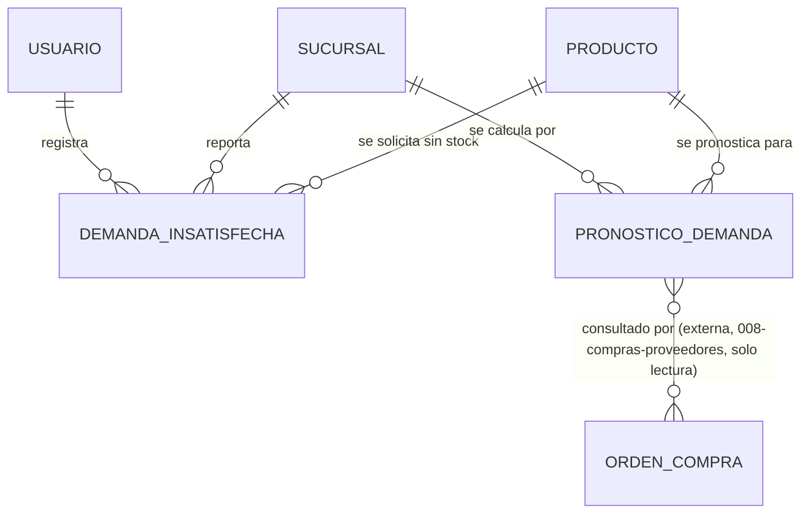

# Modelo de Datos: Pronóstico de Demanda

**Feature**: `004-pronostico-demanda` | **Fecha**: 2026-09-04
**Origen**: `spec.md` (entidades clave) + `research.md` (Decisiones 1-3)

## Diagrama de relaciones

`PRODUCTO` es propiedad de `001-core-ventas-inventario`; `SUCURSAL` y `USUARIO` son propiedad de Expansión y Sucursales / Administración. `ORDEN_COMPRA`/`DETALLE_ORDEN_COMPRA` son propiedad de `008-compras-proveedores` — ese módulo consulta este módulo por HTTP para resolver su `RN-CP-001`, nunca hay FK directa entre ambos. *(Enmienda v1.1)* `demanda_insatisfecha.sustituto_ofrecido_id` referencia `producto_sustituto` de `001-core-ventas-inventario`; `evento_local` no tiene FK hacia ninguna otra tabla de negocio, solo hacia `sucursal`/`usuario` — es consumido por el modelo de pronóstico al entrenar (join por fecha, no por FK).

## Tablas

### `tipo_evento_local` *(catálogo maestro, añadido en enmienda v1.2)*

| Campo | Tipo | Restricciones |
|---|---|---|
| codigo | VARCHAR(40) | PK — `'feriado'`, `'fiesta_patronal'`, `'evento_comunitario'`, `'clima_extremo'`, `'corte_servicios'` |
| etiqueta | VARCHAR(80) | NOT NULL |
| afecta_demanda_al_alza | BOOLEAN | NOT NULL |
| orden | SMALLINT | NOT NULL, DEFAULT 0 |
| activo | BOOLEAN | NOT NULL, DEFAULT true |

Clave natural, igual que el resto de catálogos de vocabulario cerrado del proyecto. Seed dentro de la misma migración.

`afecta_demanda_al_alza` es el atributo que justifica el catálogo, y es específico de este módulo: **el signo esperado del efecto es un dato, no una suposición del modelo**. Un feriado o una fiesta patronal sube la demanda; un corte de servicios o un clima extremo la baja. Sin esa columna, el modelo de pronóstico tiene que inferir el signo de cada tipo de evento a partir de los datos, y con pocos eventos por tipo esa inferencia es poco confiable — justo el problema de confusores del Art. 5.6 que este módulo existe para resolver.

Es también lo que permite validar el pronóstico: si el modelo descuenta un feriado *a la baja*, hay un error, y con el catálogo eso es detectable.

Este catálogo **no se borra nunca**; baja lógica con `activo = false` (RN-PD-002). Los eventos históricos registrados con un tipo son insumo permanente del modelo de pronóstico: borrar el tipo dejaría esas filas sin significado y degradaría el entrenamiento hacia atrás, sin ningún error visible.

### `demanda_insatisfecha`

| Campo | Tipo | Restricciones |
|---|---|---|
| id | BIGSERIAL | PK |
| sucursal_id | BIGINT | NOT NULL, FK → sucursal |
| producto_id | BIGINT | NOT NULL, FK → producto |
| cajero_id | BIGINT | NOT NULL, FK → usuario |
| hora_evento | TIMESTAMPTZ | NOT NULL — puede diferir de `hora_registro` (RF-PD-002) |
| hora_registro | TIMESTAMPTZ | NOT NULL, DEFAULT now() |
| sustituto_ofrecido_id | BIGINT | NULL, FK → producto (externa, `001-core-ventas-inventario.producto_sustituto`) — RF-PD-006, enmienda v1.1 |
| sustituto_aceptado | BOOLEAN | NULL — NULL si no se ofreció ningún sustituto; `true`/`false` si sí se ofreció, CHECK (sustituto_aceptado IS NULL OR sustituto_ofrecido_id IS NOT NULL) |

Índices: `(sucursal_id, producto_id, hora_evento)` — es el índice que usa el modelo de pronóstico al entrenar (RF-PD-003).

### `pronostico_demanda`

| Campo | Tipo | Restricciones |
|---|---|---|
| id | BIGSERIAL | PK |
| producto_id | BIGINT | NOT NULL, FK → producto |
| sucursal_id | BIGINT | NOT NULL, FK → sucursal |
| cantidad_recomendada | NUMERIC(10,3) | NOT NULL, CHECK (cantidad_recomendada >= 0) |
| tamano_muestra | INTEGER | NOT NULL, CHECK (tamano_muestra > 0) |
| periodo_inicio | DATE | NOT NULL |
| periodo_fin | DATE | NOT NULL |
| fecha_calculo | TIMESTAMPTZ | NOT NULL, DEFAULT now() |

Índices: `(producto_id, sucursal_id, fecha_calculo DESC)` — soporta la consulta del pronóstico vigente (Decisión 2 de `research.md`).

### `evento_local` *(añadida en enmienda v1.1, auditoría enunciado-vs-specs)*

| Campo | Tipo | Restricciones |
|---|---|---|
| id | BIGSERIAL | PK |
| sucursal_id | BIGINT | NULL, FK → sucursal — NULL significa que afecta a toda la cadena (p. ej. un feriado nacional), no NULL restringe el efecto a una sucursal (p. ej. una fiesta patronal local) |
| fecha_inicio | DATE | NOT NULL |
| fecha_fin | DATE | NOT NULL, CHECK (fecha_fin >= fecha_inicio) |
| tipo | VARCHAR(40) | NOT NULL, FK → tipo_evento_local(codigo) — *enmienda v1.2, antes era CHECK IN (...)* |
| descripcion | TEXT | NOT NULL, CHECK (length(descripcion) >= 3) |
| registrado_por | BIGINT | NOT NULL, FK → usuario |
| creado_en | TIMESTAMPTZ | NOT NULL, DEFAULT now() |

Índices: `(fecha_inicio, fecha_fin)`, `(sucursal_id, fecha_inicio)`. No es append-only en sentido estricto por el modelo de negocio (un evento se puede editar si se registró con una fecha mal digitada), pero no tiene ciclo de vida transaccional (`activo`/`inactivo`) — es un catálogo simple de eventos conocidos, consumido por el modelo de pronóstico al entrenar como feature adicional.

## Notas de integridad transversales

- `pronostico_demanda` es estrictamente append-only (RNF-PD-002): ningún router de este módulo expone `UPDATE`/`DELETE` sobre pronósticos ya registrados.
- El endpoint de consulta de pronóstico (RF-PD-005) responde `datos_suficientes: false` en vez de omitir campos o devolver `cantidad_recomendada: 0` cuando no existe ninguna fila para el producto/sucursal consultado (RN-PD-001).
- `008-compras-proveedores` consulta este módulo por HTTP (nunca por FK ni por acceso directo a esta base de datos) para marcar `pronostico_consultado = true` en su propia tabla `detalle_orden_compra` — la escritura de esa marca ocurre enteramente dentro de `008`, este módulo solo responde la consulta de solo lectura.
