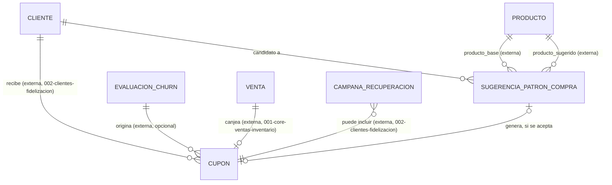

# Modelo de Datos: Promociones Inteligentes

**Feature**: `005-promociones-inteligentes` | **Fecha**: 2026-09-04
**Origen**: `spec.md` (entidades clave) + `research.md` (Decisiones 1-3)

## Diagrama de relaciones

`CLIENTE` y `EVALUACION_CHURN` son propiedad de `002-clientes-fidelizacion`; `VENTA` es propiedad de `001-core-ventas-inventario` — todas se referencian aquí solo por FK, nunca se escriben desde este módulo (RNF-PI-001). `CAMPANA_RECUPERACION` (también de `002-clientes-fidelizacion`) referencia `cupon_id` hacia esta tabla en sentido inverso. *(Enmienda v1.2)* `PRODUCTO` (`001-core-ventas-inventario`) se referencia igual, solo por FK, desde `sugerencia_patron_compra`.

## Catálogos maestros *(añadidos en enmienda v1.1 — normalización de catálogos)*

Clave natural en los tres. Seed dentro de la misma migración que los crea.

### `tipo_origen_cupon`

| Campo | Tipo | Restricciones |
|---|---|---|
| codigo | VARCHAR(40) | PK — `'cumpleanos'`, `'patron_compra'`, `'recuperacion_churn'` |
| etiqueta | VARCHAR(80) | NOT NULL |
| es_automatico | BOOLEAN | NOT NULL |
| requiere_evaluacion_churn | BOOLEAN | NOT NULL |
| orden | SMALLINT | NOT NULL, DEFAULT 0 |
| activo | BOOLEAN | NOT NULL, DEFAULT true |

`es_automatico` separa el cupón que dispara el sistema (patrón de compra detectado, cumpleaños) del que emite una persona. Es el **denominador** del indicador de OT2.3 (% de cupones bien segmentados): medir la segmentación mezclando cupones automáticos con manuales daría un número sin sentido, porque solo los automáticos los segmenta el modelo.

`requiere_evaluacion_churn` convierte en dato lo que hoy es un CHECK escrito a mano en `cupon` (RN-PI-002). El CHECK sigue existiendo, pero ahora la regla también es consultable: un formulario puede saber si debe pedir la evaluación de origen sin tenerlo quemado en la plantilla.

### `tipo_descuento`

| Campo | Tipo | Restricciones |
|---|---|---|
| codigo | VARCHAR(40) | PK — `'porcentaje'`, `'monto_fijo'` |
| etiqueta | VARCHAR(80) | NOT NULL |
| valor_maximo_permitido | NUMERIC(10,2) | NOT NULL, CHECK (valor_maximo_permitido > 0) |
| orden | SMALLINT | NOT NULL, DEFAULT 0 |
| activo | BOOLEAN | NOT NULL, DEFAULT true |

`valor_maximo_permitido` es un tope de seguridad que hoy no existe en ninguna parte: `descuento_valor` solo valida `>= 0`, así que un cupón de `descuento_valor = 200` con `tipo = 'porcentaje'` se puede crear hoy sin error y regalaría el producto pagándole al cliente. Con el catálogo, el tope es 100 para porcentaje y un monto razonable para monto fijo (RN-PI-004).

### `estado_cupon`

| Campo | Tipo | Restricciones |
|---|---|---|
| codigo | VARCHAR(40) | PK — `'activo'`, `'canjeado'`, `'expirado'` |
| etiqueta | VARCHAR(80) | NOT NULL |
| es_estado_final | BOOLEAN | NOT NULL — `activo` es el único `false` |
| permite_canje | BOOLEAN | NOT NULL — solo `activo` es `true` |
| orden | SMALLINT | NOT NULL, DEFAULT 0 |
| activo | BOOLEAN | NOT NULL, DEFAULT true |

`permite_canje` saca del código la condición del canje (RF-PI-002): en vez de comparar contra el literal `'activo'` en el servicio, se consulta el catálogo.

### `estado_sugerencia_patron` *(añadido en enmienda v1.2, auditoría de riesgos derivados)*

| Campo | Tipo | Restricciones |
|---|---|---|
| codigo | VARCHAR(40) | PK — `'pendiente'`, `'aceptada'`, `'descartada'` |
| etiqueta | VARCHAR(80) | NOT NULL |
| es_estado_final | BOOLEAN | NOT NULL — `pendiente` es el único `false` |
| orden | SMALLINT | NOT NULL, DEFAULT 0 |
| activo | BOOLEAN | NOT NULL, DEFAULT true |

Mismo criterio que `estado_cupon`/`estado_alerta`/`estado_incidencia` (006): catálogo en vez de un `CHECK IN (...)` fijo, para no repetir el problema que la enmienda v1.2 de 006 tuvo que corregir después en varios catálogos ya existentes.

## Tablas

### `cupon`

| Campo | Tipo | Restricciones |
|---|---|---|
| id | BIGSERIAL | PK |
| cliente_id | BIGINT | NOT NULL, FK → cliente (externa) |
| tipo_origen | VARCHAR(40) | NOT NULL, FK → tipo_origen_cupon(codigo) — Decisión 2; *enmienda v1.1, antes era CHECK IN (...)* |
| evaluacion_churn_id | BIGINT | NULL, FK → evaluacion_churn (externa) — solo si `tipo_origen = 'recuperacion_churn'` |
| codigo | TEXT | NOT NULL, UNIQUE |
| descuento_tipo | VARCHAR(40) | NOT NULL, FK → tipo_descuento(codigo) — *enmienda v1.1* |
| descuento_valor | NUMERIC(10,2) | NOT NULL, CHECK (descuento_valor >= 0) |
| fecha_envio | TIMESTAMPTZ | NOT NULL, DEFAULT now() |
| fecha_expiracion | TIMESTAMPTZ | NOT NULL |
| estado | VARCHAR(40) | NOT NULL, DEFAULT 'activo', FK → estado_cupon(codigo) — *enmienda v1.1* |
| venta_id_canje | BIGINT | NULL, FK → venta (externa) — se llena al canjear |
| fecha_canje | TIMESTAMPTZ | NULL |

Restricción adicional: **CHECK** `(tipo_origen <> 'recuperacion_churn' OR evaluacion_churn_id IS NOT NULL)` — impone RN-PI-002, un cupón de recuperación siempre debe poder trazarse hasta la evaluación que lo originó.

*(Enmienda v1.1)* Ese CHECK **se mantiene tal cual**, aunque `tipo_origen_cupon.requiere_evaluacion_churn` exprese ahora la misma regla como dato. Los dos cumplen funciones distintas: el CHECK la impone fila por fila en la base y no depende de que nadie lea el catálogo; la columna del catálogo la hace consultable para que un formulario sepa si debe pedir el campo. Sustituir el CHECK por una validación que dependa del catálogo debilitaría la garantía sin ganar nada.

Índices: `(cliente_id, estado)`, `(codigo)` único.

### `sugerencia_patron_compra` *(añadida en enmienda v1.2, auditoría de riesgos derivados)*

| Campo | Tipo | Restricciones |
|---|---|---|
| id | BIGSERIAL | PK |
| cliente_id | BIGINT | NOT NULL, FK → cliente (externa) |
| producto_base_id | BIGINT | NOT NULL, FK → producto (externa, `001-core-ventas-inventario`) — el producto que el cliente ya compra con frecuencia |
| producto_sugerido_id | BIGINT | NOT NULL, FK → producto (externa) — la oportunidad: el cliente no lo ha comprado nunca |
| veces_comprado_base | INTEGER | NOT NULL, CHECK (> 0) |
| soporte | NUMERIC(6,4) | NOT NULL, CHECK (entre 0 y 1) |
| confianza | NUMERIC(6,4) | NOT NULL, CHECK (entre 0 y 1) |
| lift | NUMERIC(8,4) | NOT NULL, CHECK (>= 0) |
| periodo_dias | INTEGER | NOT NULL, CHECK (> 0) — ventana de análisis usada para calcular la regla |
| estado | VARCHAR(40) | NOT NULL, DEFAULT 'pendiente', FK → estado_sugerencia_patron(codigo) |
| generado_en | TIMESTAMPTZ | NOT NULL, DEFAULT now() |
| atendida_en | TIMESTAMPTZ | NULL |
| atendida_por | BIGINT | NULL, FK → usuario |
| cupon_id | BIGINT | NULL, FK → cupon — se llena solo si `estado = 'aceptada'` |

Restricciones adicionales: **CHECK** `(producto_base_id <> producto_sugerido_id)`; índice único parcial `(cliente_id, producto_sugerido_id) WHERE estado = 'pendiente'` — evita que un recálculo repetido duplique una sugerencia que ya está esperando una decisión humana (sí permite volver a sugerir el mismo par después de que la anterior se resolvió, en un recálculo futuro).

Índices: `(cliente_id, estado)`; el único parcial de arriba.

Es la salida de un cálculo real de asociación de mercado (soporte/confianza/lift, terminología estándar de análisis de canasta de compra) sobre `detalle_venta`/`venta`, calculado por `app/services/patron_compra.py` y expuesto por `POST /promociones/sugerencias-patron/recalcular` — nunca a mano ni con datos simulados (ver research.md, Decisión 5). Nunca crea un `cupon` por sí sola: solo cuando `PATCH .../{id}/resolver` la acepta (RN-PI-005), mismo principio "sistema sugiere, humano confirma" que `recomendacion_precio` (003, RN-PM-002).

## Notas de integridad transversales

- Este módulo nunca escribe en `cliente`, `evaluacion_churn` (`002-clientes-fidelizacion`) ni en `venta`/`detalle_venta` (`001-core-ventas-inventario`) — todas son referencias externas de solo lectura o FK (RNF-PI-001).
- El canje de un cupón (RF-PI-002) es una transacción atómica: valida `estado = 'activo'` y `fecha_expiracion > now()` antes de actualizar `estado = 'canjeado'`, `venta_id_canje` y `fecha_canje` en la misma operación — nunca dos pasos separados que puedan dejar un cupón inconsistente si la venta falla a mitad de camino.
- *(Enmienda v1.1)* Ninguno de los tres catálogos se borra; baja lógica con `activo = false`. Un cupón ya emitido debe conservar el significado de su tipo de origen y de su tipo de descuento aunque el negocio deje de usarlos.
- A diferencia de los patrones append-only usados en otros módulos (`historial_precio_producto`, `segmento_cliente`), `cupon` sí usa `UPDATE` sobre su propio `estado` — porque un cupón es un recurso de un solo uso con un ciclo de vida cerrado (no una serie histórica que deba reconstruirse en el tiempo), la misma distinción que ya se documentó para `recepcion_orden_compra` vs. `turno_caja` en otros módulos.
- *(Enmienda v1.2)* `sugerencia_patron_compra` es la única excepción real a RNF-PI-001: el motor de asociación **lee** `detalle_venta`/`venta` directamente (nunca escribe ahí) para calcular soporte/confianza/lift. Es una excepción acotada y explícita, no una violación silenciosa — RNF-PI-001 sigue prohibiendo la escritura, nunca prohibió la lectura, y sin leer las ventas reales el motor no tendría con qué calcular nada.
- *(Enmienda v1.2)* `sugerencia_patron_compra` sí usa `UPDATE` sobre `estado`/`atendida_en`/`atendida_por`/`cupon_id`, igual que `cupon` — mismo motivo: es un recurso de un solo uso (pendiente → aceptada/descartada), no una serie histórica.
