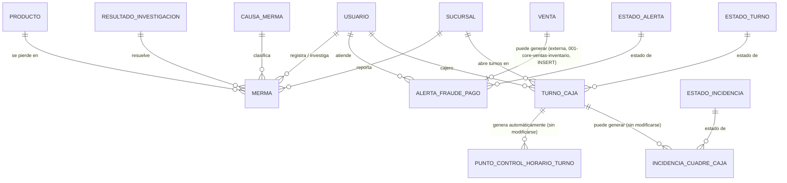

# Modelo de Datos: Caja, Mermas y Fraude

**Feature**: `006-caja-mermas-fraude` | **Fecha**: 2026-09-04
**Origen**: `spec.md` (entidades clave) + `research.md` (Decisiones 1-4)

## Diagrama de relaciones

`VENTA` es propiedad de `001-core-ventas-inventario` — ese módulo hace el único `INSERT` en `alerta_fraude_pago` (Decisión 3), el resto de este módulo nunca la escribe. `PRODUCTO` también es propiedad de `001-core-ventas-inventario`; `SUCURSAL`/`USUARIO` son propiedad de Expansión y Sucursales / Administración.

## Catálogos maestros *(añadidos en enmienda v1.2 — normalización de catálogos)*

Clave natural en los cinco. Seed dentro de la misma migración que los crea.

### `causa_merma`

| Campo | Tipo | Restricciones |
|---|---|---|
| codigo | VARCHAR(40) | PK — `'robo_externo'`, `'error_humano'`, `'fraude_interno'`, `'caducidad'` |
| etiqueta | VARCHAR(80) | NOT NULL |
| es_atribuible_a_persona | BOOLEAN | NOT NULL |
| requiere_investigacion | BOOLEAN | NOT NULL |
| orden | SMALLINT | NOT NULL, DEFAULT 0 |
| activo | BOOLEAN | NOT NULL, DEFAULT true |

**`es_atribuible_a_persona` es el atributo más importante de toda la enmienda transversal.** Separa las causas donde no hay un responsable interno (`robo_externo`, `caducidad`) de aquellas donde sí lo hay (`error_humano`, `fraude_interno`). Sin esa columna, el cruce merma × cuadre de caja que exige OT3.4 tiene que enumerar los códigos a mano en cada consulta e informe — y cada vez que alguien escribe esa lista puede olvidar uno, con el resultado de que un fraude interno se contabilice como pérdida no atribuible.

Es además la línea divisoria entre dos respuestas de negocio distintas: una merma no atribuible se combate con seguridad física o con gestión de caducidad; una atribuible dispara una investigación sobre una persona.

`requiere_investigacion` complementa a RN-CMF-003: `caducidad` es la única causa que normalmente no exige investigación, porque la explicación ya está en la fecha del lote.

### `resultado_investigacion`

| Campo | Tipo | Restricciones |
|---|---|---|
| codigo | VARCHAR(40) | PK — `'confirmada'`, `'descartada'` |
| etiqueta | VARCHAR(80) | NOT NULL |
| cierra_investigacion | BOOLEAN | NOT NULL |
| orden | SMALLINT | NOT NULL, DEFAULT 0 |
| activo | BOOLEAN | NOT NULL, DEFAULT true |

La tabla y la columna `merma.resultado_investigacion` comparten nombre. Es válido en PostgreSQL — tablas y columnas viven en espacios de nombres distintos, y `resultado_investigacion VARCHAR(40) REFERENCES resultado_investigacion(codigo)` es una FK correcta. Se mantiene el nombre de la columna original para no romper el contrato ya publicado ni las consultas existentes.

### `estado_turno`

| Campo | Tipo | Restricciones |
|---|---|---|
| codigo | VARCHAR(40) | PK — `'abierto'`, `'cerrado'` |
| etiqueta | VARCHAR(80) | NOT NULL |
| es_estado_final | BOOLEAN | NOT NULL |
| admite_ventas | BOOLEAN | NOT NULL — solo `abierto` es `true` |
| orden | SMALLINT | NOT NULL, DEFAULT 0 |
| activo | BOOLEAN | NOT NULL, DEFAULT true |

`admite_ventas` saca del código la condición que `001-core-ventas-inventario` valida al registrar una venta contra un `turno_caja_id`.

### `estado_alerta`

| Campo | Tipo | Restricciones |
|---|---|---|
| codigo | VARCHAR(40) | PK — `'abierta'`, `'atendida'` |
| etiqueta | VARCHAR(80) | NOT NULL |
| es_estado_final | BOOLEAN | NOT NULL |
| orden | SMALLINT | NOT NULL, DEFAULT 0 |
| activo | BOOLEAN | NOT NULL, DEFAULT true |

### `estado_incidencia`

| Campo | Tipo | Restricciones |
|---|---|---|
| codigo | VARCHAR(40) | PK — `'pendiente'`, `'atendida'` |
| etiqueta | VARCHAR(80) | NOT NULL |
| es_estado_final | BOOLEAN | NOT NULL |
| orden | SMALLINT | NOT NULL, DEFAULT 0 |
| activo | BOOLEAN | NOT NULL, DEFAULT true |

`estado_alerta` y `estado_incidencia` se mantienen como **dos catálogos separados** aunque hoy sus valores sean equivalentes: una alerta de fraude en un pago con tarjeta y una incidencia de cuadre de caja son procesos distintos, y unificarlos obligaría a que el día que uno de los dos gane un estado nuevo (`en_revision`, `escalada`) ese estado aparezca también como opción válida del otro.

## Tablas

### `turno_caja`

| Campo | Tipo | Restricciones |
|---|---|---|
| id | BIGSERIAL | PK |
| sucursal_id | BIGINT | NOT NULL, FK → sucursal |
| cajero_id | BIGINT | NOT NULL, FK → usuario |
| hora_apertura | TIMESTAMPTZ | NOT NULL, DEFAULT now() |
| monto_inicial | NUMERIC(10,2) | NOT NULL, CHECK (monto_inicial >= 0) |
| hora_cierre | TIMESTAMPTZ | NULL |
| monto_contado | NUMERIC(10,2) | NULL, CHECK (monto_contado >= 0) — obligatorio al cerrar (RF-CMF-004) |
| monto_esperado | NUMERIC(10,2) | NULL — calculado y guardado SOLO al cerrar, sumando las ventas en efectivo de ese turno consultadas en `001-core-ventas-inventario` |
| diferencia | NUMERIC(10,2) | GENERATED ALWAYS AS (monto_contado - monto_esperado) STORED |
| motivo_diferencia | TEXT | NULL — CHECK (estado <> 'cerrado' OR diferencia = 0 OR motivo_diferencia IS NOT NULL), RN-CMF-002 |
| estado | VARCHAR(40) | NOT NULL, DEFAULT 'abierto', FK → estado_turno(codigo) — *enmienda v1.2, antes era CHECK IN (...)* |

Restricción adicional: **índice único parcial** `UNIQUE (cajero_id) WHERE estado = 'abierto'` — impone RN-CMF-001, un cajero no puede tener dos turnos abiertos a la vez.

Índices: `(sucursal_id, estado)`.

### `alerta_fraude_pago`

| Campo | Tipo | Restricciones |
|---|---|---|
| id | BIGSERIAL | PK |
| venta_id | BIGINT | NOT NULL, FK → venta (externa, `001-core-ventas-inventario`) |
| motivo | TEXT | NOT NULL |
| estado | VARCHAR(40) | NOT NULL, DEFAULT 'abierta', FK → estado_alerta(codigo) — *enmienda v1.2* |
| ultimos_4_digitos | CHAR(4) | NULL — NUNCA el número completo de tarjeta (Art. 10.8, RNF-CMF-003) |
| codigo_respuesta_proveedor | TEXT | NULL — respuesta del proveedor sandbox (Art. 8.2), no un dato bancario real |
| creada_en | TIMESTAMPTZ | NOT NULL, DEFAULT now() |
| atendida_en | TIMESTAMPTZ | NULL |
| atendida_por | BIGINT | NULL, FK → usuario |

**Escritura cruzada documentada (Decisión 3):** el `INSERT` de esta tabla ocurre exclusivamente desde el servicio de ventas de `001-core-ventas-inventario` en el momento de procesar el pago; el `UPDATE` de atención (`estado`, `atendida_en`, `atendida_por`) ocurre exclusivamente desde el servicio de este módulo. Es la única tabla de todo el proyecto escrita por dos módulos distintos.

Índices: `(estado)`, `(venta_id)`.

### `merma`

| Campo | Tipo | Restricciones |
|---|---|---|
| id | BIGSERIAL | PK |
| producto_id | BIGINT | NOT NULL, FK → producto (externa, `001-core-ventas-inventario`) |
| sucursal_id | BIGINT | NOT NULL, FK → sucursal |
| cantidad | NUMERIC(10,3) | NOT NULL, CHECK (cantidad > 0) |
| valor_estimado | NUMERIC(10,2) | NOT NULL, CHECK (valor_estimado > 0) |
| causa | VARCHAR(40) | NULL, FK → causa_merma(codigo) — asignable después de la detección (RF-CMF-006); *enmienda v1.2, antes era CHECK IN (...)* |
| resultado_investigacion | VARCHAR(40) | NULL, FK → resultado_investigacion(codigo), CHECK (resultado_investigacion IS NULL OR causa IS NOT NULL) — RN-CMF-003; *enmienda v1.2* |
| fecha_deteccion | TIMESTAMPTZ | NOT NULL, DEFAULT now() |
| fecha_resultado | TIMESTAMPTZ | NULL |
| registrado_por | BIGINT | NOT NULL, FK → usuario |
| investigado_por | BIGINT | NULL, FK → usuario |

Índices: `(sucursal_id, causa, fecha_deteccion)`.

### `incidencia_cuadre_caja`

| Campo | Tipo | Restricciones |
|---|---|---|
| id | BIGSERIAL | PK |
| turno_caja_id | BIGINT | NOT NULL, FK → turno_caja (misma tabla de este módulo, solo lectura desde el servicio de detección) |
| score_anomalia | NUMERIC(5,4) | NOT NULL — score del modelo Isolation Forest |
| justificacion | TEXT | NOT NULL, CHECK (length(justificacion) >= 10) — Art. 5.9 |
| estado | VARCHAR(40) | NOT NULL, DEFAULT 'pendiente', FK → estado_incidencia(codigo) — *enmienda v1.2* |
| fecha_deteccion | TIMESTAMPTZ | NOT NULL, DEFAULT now() |
| atendida_por | BIGINT | NULL, FK → usuario |
| fecha_atencion | TIMESTAMPTZ | NULL |

Restricción adicional: **índice único parcial** `UNIQUE (turno_caja_id) WHERE estado = 'pendiente'` — impone RN-CMF-005, nunca dos incidencias pendientes del mismo turno.

Índices: `(estado)`.

### `punto_control_horario_turno` *(añadida en enmienda v1.1, auditoría enunciado-vs-specs)*

| Campo | Tipo | Restricciones |
|---|---|---|
| id | BIGSERIAL | PK |
| turno_caja_id | BIGINT | NOT NULL, FK → turno_caja (misma tabla de este módulo, solo lectura desde el job que genera los checkpoints) |
| hora_checkpoint | TIMESTAMPTZ | NOT NULL, DEFAULT now() |
| monto_esperado_acumulado | NUMERIC(10,2) | NOT NULL, CHECK (monto_esperado_acumulado >= 0) — suma de ventas en efectivo del turno hasta ese instante, mismo cálculo que `monto_esperado` de `turno_caja` pero tomado a mitad de turno |
| generado_en | TIMESTAMPTZ | NOT NULL, DEFAULT now() |

Índices: `(turno_caja_id, hora_checkpoint)`. Estrictamente append-only y de generación exclusivamente automática (RN-CMF-006): no existe ningún endpoint `PATCH`/`DELETE`, ni un `POST` accesible por un rol humano — el único `INSERT` lo hace el job programado descrito en `research.md`, Decisión 5.

### `arqueo_parcial_turno` *(añadida en enmienda v1.3, auditoría de riesgos derivados)*

| Campo | Tipo | Restricciones |
|---|---|---|
| id | BIGSERIAL | PK |
| turno_caja_id | BIGINT | NOT NULL, FK → turno_caja |
| monto_esperado_acumulado | NUMERIC(10,2) | NOT NULL, CHECK (monto_esperado_acumulado >= 0) — mismo cálculo que `monto_esperado` de `turno_caja` y que `punto_control_horario_turno.monto_esperado_acumulado`, tomado en el instante del arqueo |
| monto_contado | NUMERIC(10,2) | NOT NULL, CHECK (monto_contado >= 0) — conteo físico real, ingresado por quien registra el arqueo |
| diferencia | NUMERIC(10,2) | GENERATED ALWAYS AS (monto_contado - monto_esperado_acumulado) STORED |
| motivo_diferencia | TEXT | NULL; CHECK (diferencia = 0 OR motivo_diferencia IS NOT NULL) — obligatorio en cuanto hay descuadre |
| registrado_por | BIGINT | NOT NULL, FK → usuario |
| hora_arqueo | TIMESTAMPTZ | NOT NULL, DEFAULT now() |

Índices: `(turno_caja_id, hora_arqueo)`. Estrictamente append-only, sin `PATCH`/`DELETE` — a diferencia de `punto_control_horario_turno` (que solo el job automático inserta), aquí el `INSERT` lo hace un humano: el propio cajero contando su caja a mitad de turno, o el encargado de sucursal haciendo un spot-check de supervisión (RN-CMF-009). Es el complemento voluntario y real que la Decisión 5 de la enmienda v1.1 explícitamente dejó fuera de la generación automática, para no imponer una carga operativa ni un conteo "simulado" obligatorio cada hora — pero sin él no existía ninguna forma de que un cuadre de caja *real* (con billetes contados en mano) ocurriera antes del cierre de turno. `punto_control_horario_turno` sigue siendo el checkpoint calculado; `arqueo_parcial_turno` es el checkpoint contado.

## Notas de integridad transversales

- `incidencia_cuadre_caja` nunca modifica `turno_caja`, aunque ambas tablas vivan en este mismo módulo (RNF-CMF-002, Decisión 2) — es la única forma en que el modelo de detección de anomalías interactúa con los cuadres de caja.
- El `UPDATE` sobre `alerta_fraude_pago` desde este módulo, junto con el `INSERT` desde `001-core-ventas-inventario`, es la única escritura cruzada entre módulos de todo el proyecto (Decisión 3) — cualquier necesidad futura similar debe documentarse con el mismo nivel de detalle, no asumirse por comodidad.
- `turno_caja` es append-only una vez cerrado: ningún endpoint permite reabrir ni editar un turno con `estado = 'cerrado'` (RNF-CMF-001).
- *(Enmienda v1.1)* `punto_control_horario_turno` tampoco modifica `turno_caja`, igual que `incidencia_cuadre_caja` (Decisión 2) — es una tabla puramente aditiva, generada por un job interno, nunca por un cajero ni por ningún otro rol humano.
- *(Enmienda v1.2)* Ninguno de los cinco catálogos se borra; baja lógica con `activo = false` (RN-CMF-008). Es especialmente crítico en `causa_merma`: borrar una causa dejaría mermas históricas sin clasificación, y con ellas el cruce merma × cuadre de caja de OT3.4 perdería exactamente los casos que más importan — los ya investigados.
- *(Enmienda v1.3)* `arqueo_parcial_turno` tampoco modifica `turno_caja`, mismo principio que `punto_control_horario_turno` (Decisión 2): es aditiva y de solo lectura hacia el resto del módulo. La diferencia con `punto_control_horario_turno` es quién y cómo la genera — humano y voluntario aquí, job automático allá — no su relación con `turno_caja`.
