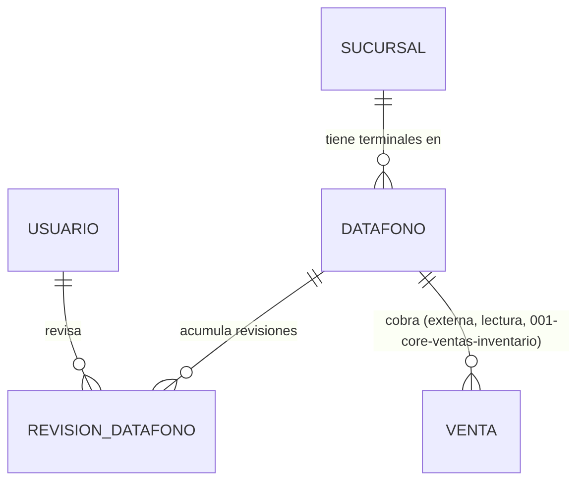

# Modelo de Datos: Pagos y Seguridad

**Feature**: `007-pagos-seguridad` | **Fecha**: 2026-09-04
**Origen**: `spec.md` (entidades clave) + `research.md` (Decisiones 1-3)

## Diagrama de relaciones

`SUCURSAL` y `USUARIO` son propiedad de Expansión y Sucursales / Administración (aún no construidos bajo esta estructura). Este módulo no comparte tablas con `006-caja-mermas-fraude` (Decisión 1 de `research.md`). *(Enmienda v1.2)* `VENTA` (`001-core-ventas-inventario`) se lee, nunca se escribe, para el reporte de trazabilidad `GET /pagos/datafonos/{id}/ventas` (Decisión 5).

## Catálogo maestro *(añadido en enmienda v1.1 — normalización de catálogos)*

### `estado_revision`

| Campo | Tipo | Restricciones |
|---|---|---|
| codigo | VARCHAR(40) | PK — `'actualizado'`, `'vencido'` |
| etiqueta | VARCHAR(80) | NOT NULL |
| cuenta_como_conforme | BOOLEAN | NOT NULL |
| orden | SMALLINT | NOT NULL, DEFAULT 0 |
| activo | BOOLEAN | NOT NULL, DEFAULT true |

Clave natural, seed en la misma migración.

`cuenta_como_conforme` define el **numerador** del indicador de OT4.4 (% de terminales con validación de seguridad actualizada). Hoy ese numerador está implícito en un `WHERE estado = 'actualizado'` repetido en cada consulta. Con la columna, agregar un estado intermedio en el futuro — por ejemplo `'en_revision'` mientras el proveedor certifica el terminal — no obliga a revisar cada consulta para decidir si cuenta o no: se decide una vez, al insertar la fila del catálogo.

Es el mismo patrón que `estado_venta.cuenta_para_ingresos` en `001-core-ventas-inventario`: una regla de negocio que estaba repetida como filtro en las consultas pasa a ser un dato del modelo.

## Tablas

### `datafono`

| Campo | Tipo | Restricciones |
|---|---|---|
| id | BIGSERIAL | PK |
| sucursal_id | BIGINT | NOT NULL, FK → sucursal |
| codigo_serie | TEXT | NOT NULL, UNIQUE |
| activo | BOOLEAN | NOT NULL, DEFAULT true |

Índices: `(sucursal_id, activo)`.

### `revision_datafono`

| Campo | Tipo | Restricciones |
|---|---|---|
| id | BIGSERIAL | PK |
| datafono_id | BIGINT | NOT NULL, FK → datafono |
| estado | VARCHAR(40) | NOT NULL, FK → estado_revision(codigo) — *enmienda v1.1, antes era CHECK IN (...)* |
| observaciones | TEXT | NULL |
| fecha_revision | TIMESTAMPTZ | NOT NULL, DEFAULT now() |
| revisado_por | BIGINT | NOT NULL, FK → usuario |

Índices: `(datafono_id, fecha_revision DESC)` — soporta obtener el estado vigente (Decisión 2).

## Notas de integridad transversales

- `revision_datafono` es estrictamente append-only (RNF-PS-001): ningún router de este módulo expone `UPDATE`/`DELETE` sobre revisiones ya registradas.
- Dar de baja un datáfono (`activo = false`) nunca elimina su historial de revisiones — es un `UPDATE` sobre una sola columna booleana de `datafono`, distinto del historial append-only de `revision_datafono`.
- El estado vigente (RF-PS-004) es un valor calculado en el momento de la consulta (`DISTINCT ON (datafono_id) ORDER BY fecha_revision DESC`), nunca cacheado en una columna de `datafono` (RNF-PS-001).
- *(Enmienda v1.2)* `GET /pagos/datafonos/{id}/ventas` no agrega ninguna tabla: lee `venta` (externa, `001-core-ventas-inventario`) filtrando por `datafono_id`, y para cada una calcula el estado vigente de `revision_datafono` **en la fecha de esa venta** (`fecha_revision <= venta.fecha_hora`, la más reciente que cumpla) — nunca el estado vigente de hoy (RN-PS-004).
