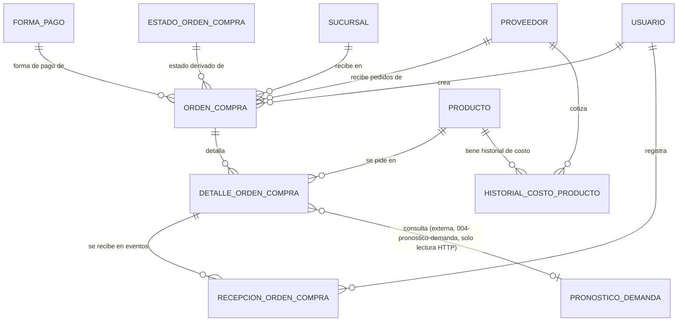

# Modelo de Datos: Compras y Proveedores

**Feature**: `008-compras-proveedores` | **Fecha**: 2026-09-04
**Origen**: `spec.md` (entidades clave) + `research.md` (Decisiones 1-4)

## Diagrama de relaciones

`PRODUCTO` es propiedad de `001-core-ventas-inventario`; `SUCURSAL` y `USUARIO` son propiedad de Expansión y Sucursales / Administración (aún no construidos); `PRONOSTICO_DEMANDA` es propiedad de `004-pronostico-demanda` — se consulta por HTTP, nunca por FK (Decisión 4).

## Catálogos maestros *(añadidos en enmienda v1.2 — normalización de catálogos)*

Clave natural en ambos. Seed en la misma migración.

### `forma_pago`

| Campo | Tipo | Restricciones |
|---|---|---|
| codigo | VARCHAR(40) | PK — `'contado'`, `'credito'` |
| etiqueta | VARCHAR(80) | NOT NULL |
| dias_plazo_default | SMALLINT | NOT NULL, CHECK (dias_plazo_default >= 0) — `0` para contado |
| orden | SMALLINT | NOT NULL, DEFAULT 0 |
| activo | BOOLEAN | NOT NULL, DEFAULT true |

`dias_plazo_default` incorpora un dato que hoy no existe en ninguna parte del modelo: **el crédito de un proveedor tiene plazo**. Saber que una orden es a crédito sin saber a cuántos días no permite anticipar cuándo hay que pagarla. Con el catálogo, el plazo por defecto queda declarado y ajustable sin migración.

Es deliberadamente un valor *por defecto* del tipo de pago, no un campo de cada orden: modelar el plazo negociado orden por orden sería un módulo de cuentas por pagar, que ningún OT de la cascada pide. Esto da el dato base sin abrir ese alcance.

### `estado_orden_compra`

| Campo | Tipo | Restricciones |
|---|---|---|
| codigo | VARCHAR(40) | PK — `'pendiente'`, `'recibida_parcial'`, `'recibida_completa'`, `'cancelada'` |
| etiqueta | VARCHAR(80) | NOT NULL |
| permite_recepcion | BOOLEAN | NOT NULL — `false` solo en `recibida_completa` y `cancelada` |
| es_estado_final | BOOLEAN | NOT NULL |
| orden | SMALLINT | NOT NULL, DEFAULT 0 |
| activo | BOOLEAN | NOT NULL, DEFAULT true |

`permite_recepcion` saca del servicio una regla que hoy vive solo ahí: una orden cancelada o ya recibida por completo no admite más recepciones.

**Importante — el estado sigue siendo derivado**: la FK agrega integridad referencial, pero no convierte `orden_compra.estado` en un campo editable. RNF-CP-001 y la Decisión 1 siguen intactas: el estado se recalcula desde el log de recepciones, y ningún endpoint lo expone para escritura directa. Un catálogo de estados no es lo mismo que un estado editable.

## Tablas

### `proveedor`

| Campo | Tipo | Restricciones |
|---|---|---|
| id | BIGSERIAL | PK |
| nombre | TEXT | NOT NULL |
| contacto | TEXT | NULL — teléfono o correo |
| activo | BOOLEAN | NOT NULL, DEFAULT true |
| creado_en | TIMESTAMPTZ | NOT NULL, DEFAULT now() |

### `orden_compra`

| Campo | Tipo | Restricciones |
|---|---|---|
| id | BIGSERIAL | PK |
| proveedor_id | BIGINT | NOT NULL, FK → proveedor |
| sucursal_id | BIGINT | NOT NULL, FK → sucursal |
| creado_por | BIGINT | NOT NULL, FK → usuario |
| fecha_pedido | TIMESTAMPTZ | NOT NULL, DEFAULT now() |
| es_oferta | BOOLEAN | NOT NULL, DEFAULT false |
| forma_pago | VARCHAR(40) | NOT NULL, DEFAULT 'contado', FK → forma_pago(codigo) — RF-CP-012, enmienda v1.1; convertido a FK en enmienda v1.2 |
| estado | VARCHAR(40) | NOT NULL, DEFAULT 'pendiente', FK → estado_orden_compra(codigo) — **derivado**, nunca editable directamente (RNF-CP-001, Decisión 1); convertido a FK en enmienda v1.2 sin dejar de ser derivado |

Índices: `(proveedor_id)`, `(sucursal_id, estado)`.

### `detalle_orden_compra`

| Campo | Tipo | Restricciones |
|---|---|---|
| id | BIGSERIAL | PK |
| orden_compra_id | BIGINT | NOT NULL, FK → orden_compra |
| producto_id | BIGINT | NOT NULL, FK → producto (externa, `001-core-ventas-inventario`) |
| cantidad_pedida | NUMERIC(10,3) | NOT NULL, CHECK (cantidad_pedida > 0) |
| precio_ofrecido | NUMERIC(10,2) | NOT NULL, CHECK (precio_ofrecido >= 0) |
| pronostico_consultado | BOOLEAN | NOT NULL, DEFAULT false — RN-CP-001 |
| cantidad_recomendada_pronostico | NUMERIC(10,3) | NULL — snapshot de la recomendación consultada en `004-pronostico-demanda`, solo si `pronostico_consultado = true` y esa consulta tenía `datos_suficientes = true` |
| motivo_no_siguio_pronostico | TEXT | NULL — CHECK (cantidad_recomendada_pronostico IS NULL OR cantidad_pedida <= cantidad_recomendada_pronostico OR motivo_no_siguio_pronostico IS NOT NULL) |

Índices: `(orden_compra_id)`, `(producto_id)`.

**Nota:** `cantidad_recibida` NO es una columna de esta tabla — es un valor calculado por el servicio (`SUM(recepcion_orden_compra.cantidad_recibida_evento)` filtrado por `detalle_orden_compra_id`), expuesto en las respuestas de la API pero nunca persistido como columna editable (Decisión 1).

### `recepcion_orden_compra`

| Campo | Tipo | Restricciones |
|---|---|---|
| id | BIGSERIAL | PK |
| detalle_orden_compra_id | BIGINT | NOT NULL, FK → detalle_orden_compra |
| cantidad_recibida_evento | NUMERIC(10,3) | NOT NULL, CHECK (cantidad_recibida_evento > 0) |
| numero_documento_proveedor | TEXT | NULL — factura o guía de remisión del proveedor, RF-CP-013, enmienda v1.1 (opcional: la recepción puede ocurrir antes de que llegue el documento físico) |
| fecha_recepcion | TIMESTAMPTZ | NOT NULL, DEFAULT now() |
| usuario_id | BIGINT | NOT NULL, FK → usuario |

Índices: `(detalle_orden_compra_id, fecha_recepcion)`.

**Regla de negocio aplicada:** cada `INSERT` en esta tabla dispara, dentro de la misma transacción del servicio, la creación de un `historial_costo_producto` (RF-CP-006) y la reevaluación del `estado` de la `orden_compra` correspondiente (RF-CP-005).

### `historial_costo_producto`

| Campo | Tipo | Restricciones |
|---|---|---|
| id | BIGSERIAL | PK |
| producto_id | BIGINT | NOT NULL, FK → producto (externa) |
| proveedor_id | BIGINT | NOT NULL, FK → proveedor |
| costo | NUMERIC(10,2) | NOT NULL, CHECK (costo >= 0) |
| orden_compra_id | BIGINT | NOT NULL, FK → orden_compra |
| fecha | TIMESTAMPTZ | NOT NULL, DEFAULT now() |

Índices: `(producto_id, proveedor_id, fecha)` — soporta tanto el historial de variación como la comparación entre proveedores (Decisión 2, vía `DISTINCT ON (proveedor_id) ORDER BY fecha DESC`).

## Notas de integridad transversales

- `historial_costo_producto` es estrictamente append-only (RNF-CP-002): ningún endpoint de este módulo expone un `UPDATE` o `DELETE` sobre esta tabla.
- El `estado` de `orden_compra` se recalcula por servicio, no por trigger de base de datos, para poder aplicar en el mismo paso la validación de RN-CP-001 (que necesita leer `detalle_orden_compra.pronostico_consultado`) antes de permitir el avance de estado.
- `producto_id` de este módulo es siempre FK hacia `001-core-ventas-inventario`; `sucursal_id`/`creado_por`/`usuario_id` son FK hacia módulos de Expansión y Sucursales / Administración (pendientes) — este módulo nunca duplica sus definiciones.
- La consulta de pronóstico (RF-CP-009) nunca persiste una tabla propia de pronósticos — consulta `004-pronostico-demanda` en el momento y solo guarda el snapshot resultante en `detalle_orden_compra` (Decisión 4).
- *(Enmienda v1.1)* `orden_compra.forma_pago` y `recepcion_orden_compra.numero_documento_proveedor` son campos aditivos sobre tablas ya existentes — no requirieron tabla nueva.
- *(Enmienda v1.2)* Convertir `orden_compra.estado` a FK **no lo vuelve editable**. La FK garantiza que el valor exista en el catálogo; RNF-CP-001 sigue prohibiendo que ningún endpoint lo escriba directamente, y el servicio lo sigue recalculando desde el log de recepciones (Decisión 1). Un catálogo de estados y un estado editable son cosas distintas.
- *(Enmienda v1.2)* Ninguno de los dos catálogos se borra; baja lógica con `activo = false`. Las órdenes históricas deben conservar el significado de su forma de pago.
