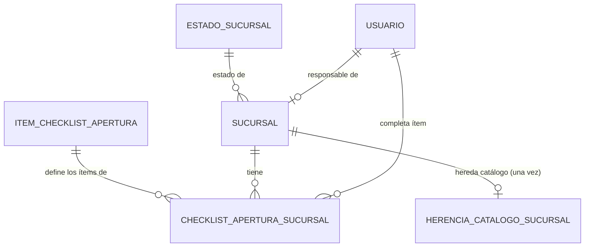

# Modelo de Datos: Expansión y Sucursales

**Feature**: `009-expansion-sucursales` | **Fecha**: 2026-09-04
**Origen**: `spec.md` (entidades clave) + `research.md` (Decisiones 1-4)

## Diagrama de relaciones

`USUARIO` es propiedad de `010-administracion`, referenciado aquí solo por FK. `PRODUCTO` (`001-core-ventas-inventario`) e `HISTORIAL_PRECIO_PRODUCTO` (`003-precios-margenes`) no se representan como FK directa porque la herencia se ejecuta vía llamada HTTP a sus endpoints ya existentes (Decisión 3 de `research.md`), no como escritura directa desde este módulo.

## Catálogos maestros *(añadidos en enmienda v1.1 — normalización de catálogos)*

Clave natural en ambos. Seed en la misma migración.

### `estado_sucursal`

| Campo | Tipo | Restricciones |
|---|---|---|
| codigo | VARCHAR(40) | PK — `'en_apertura'`, `'operativa'`, `'cerrada'` |
| etiqueta | VARCHAR(80) | NOT NULL |
| opera_ventas | BOOLEAN | NOT NULL — solo `operativa` es `true` |
| orden | SMALLINT | NOT NULL, DEFAULT 0 |
| activo | BOOLEAN | NOT NULL, DEFAULT true |

`opera_ventas` es una regla que hoy está implícita y repetida: una sucursal en apertura o cerrada no debe aparecer como origen válido de una venta, ni sumar al denominador de ningún indicador por sucursal. Como dato, `001-core-ventas-inventario` y `011-analitica-reportes` la consultan en vez de comparar contra el literal `'operativa'`.

### `item_checklist_apertura`

| Campo | Tipo | Restricciones |
|---|---|---|
| codigo | VARCHAR(40) | PK — los 8 ítems: `'local_arrendado'`, `'mobiliario_instalado'`, `'pos_instalado'`, `'personal_asignado'`, `'catalogo_heredado'`, `'precios_heredados'`, `'inspeccion_seguridad'`, `'permiso_municipal'` |
| etiqueta | VARCHAR(120) | NOT NULL |
| orden | SMALLINT | NOT NULL — el orden real de ejecución en la apertura |
| es_bloqueante | BOOLEAN | NOT NULL |
| activo | BOOLEAN | NOT NULL, DEFAULT true |

Este catálogo cambia cualitativamente el checklist. Antes, los 8 ítems estaban **escritos dentro de un CHECK**, lo que significa que agregar o quitar un paso de la apertura de una sucursal era una migración de esquema. Ahora el checklist es dato configurable: el negocio ajusta su proceso de apertura sin tocar la base.

`es_bloqueante` marca los ítems que son requisitos legales o de seguridad (`permiso_municipal`, `inspeccion_seguridad`) frente a los que son de puesta a punto (`mobiliario_instalado`). Sirve para dos cosas concretas, **sin cambiar RN-ES-001**:

1. Un ítem bloqueante **no puede darse de baja del catálogo** (`activo = false`). Los de puesta a punto sí, si el negocio decide que dejaron de ser parte del proceso. Sin esta distinción, alguien podría "simplificar" el checklist quitando la inspección de seguridad, que es exactamente lo que nunca debe poder quitarse (RN-ES-004).
2. `GET /sucursales/{id}/estado-apertura` separa los ítems pendientes en bloqueantes y no bloqueantes, para que el Encargado vea qué es crítico y qué es puesta a punto.

**RN-ES-001 no cambia**: activar la sucursal sigue exigiendo **todos** los ítems completos, bloqueantes o no. `es_bloqueante` no habilita ninguna activación con excepciones — esa sería una regla de negocio distinta, que nadie pidió.

Las filas del checklist de cada sucursal se generan leyendo los ítems `activo = true` de este catálogo, en su `orden` (Decisión 4). Una sucursal creada antes de que se agregara un ítem nuevo conserva su checklist original: los ítems ya generados no se recalculan.

## Tablas

### `sucursal`

| Campo | Tipo | Restricciones |
|---|---|---|
| id | BIGSERIAL | PK |
| nombre | TEXT | NOT NULL |
| direccion | TEXT | NOT NULL |
| responsable_id | BIGINT | NULL, FK → usuario (externa, `010-administracion`) — nullable porque en `en_apertura` puede no haber Encargado asignado aún |
| estado | VARCHAR(40) | NOT NULL, DEFAULT 'en_apertura', FK → estado_sucursal(codigo) — *enmienda v1.1, antes era CHECK IN (...)* |
| fecha_registro | TIMESTAMPTZ | NOT NULL, DEFAULT now() |
| fecha_activacion | TIMESTAMPTZ | NULL — se llena al pasar a `operativa` (RNF-ES-002, mide contra la meta de <15 días de OT3.5) |
| fecha_cierre | TIMESTAMPTZ | NULL |

### `checklist_apertura_sucursal`

| Campo | Tipo | Restricciones |
|---|---|---|
| id | BIGSERIAL | PK |
| sucursal_id | BIGINT | NOT NULL, FK → sucursal |
| item | VARCHAR(40) | NOT NULL, FK → item_checklist_apertura(codigo) — *enmienda v1.1, antes eran los 8 ítems escritos dentro de un CHECK* |
| completado | BOOLEAN | NOT NULL, DEFAULT false |
| fecha_completado | TIMESTAMPTZ | NULL |
| completado_por | BIGINT | NULL, FK → usuario (externa) |

Restricción: único `(sucursal_id, item)` — un ítem por sucursal, se actualiza (`UPDATE`), nunca se re-inserta (OO-ES02: INSERT al crear la sucursal, UPDATE al completarse). Las filas se generan automáticamente en la misma transacción que crea la `sucursal` (Decisión 4).

*(Enmienda v1.1)* Ya no son "las 8 filas" sino **las filas de los ítems `activo = true` del catálogo al momento de crear la sucursal**. Una sucursal creada antes de que se agregara un ítem nuevo conserva su checklist original: los ítems ya generados nunca se recalculan hacia atrás, porque eso reabriría el checklist de sucursales que ya están operativas.

### `herencia_catalogo_sucursal`

| Campo | Tipo | Restricciones |
|---|---|---|
| id | BIGSERIAL | PK |
| sucursal_id | BIGINT | NOT NULL, UNIQUE, FK → sucursal — único por sucursal, impone RN-ES-002 (la herencia solo se ejecuta una vez) |
| fecha | TIMESTAMPTZ | NOT NULL, DEFAULT now() |
| cantidad_productos_heredados | INTEGER | NOT NULL — productos con precio previo, sí heredados |
| cantidad_productos_pendientes | INTEGER | NOT NULL — productos sin precio previo en ninguna sucursal, quedaron pendientes de fijación manual (RN-ES-003) |

Append-only por diseño (la restricción `UNIQUE(sucursal_id)` ya impide una segunda ejecución, así que no hace falta un `estado`: la existencia de la fila ES el registro de que ya se ejecutó).
