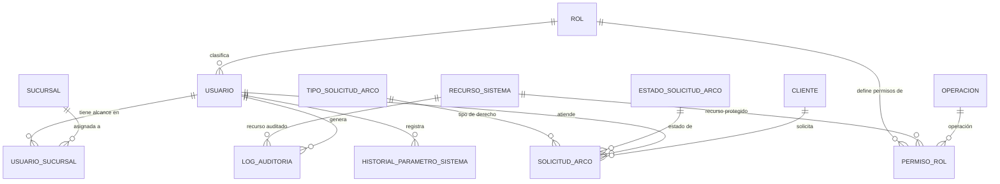

# Modelo de Datos: Administración

**Feature**: `010-administracion` | **Fecha**: 2026-09-04
**Origen**: `spec.md` (entidades clave) + `research.md` (Decisiones 1-6)

## Diagrama de relaciones

`SUCURSAL` es propiedad de `009-expansion-sucursales`; `CLIENTE` de `002-clientes-fidelizacion` — ambas referenciadas aquí solo por FK.

## Catálogos maestros *(añadidos en enmienda v1.1 — normalización de catálogos)*

Clave natural en los cinco. Seed dentro de la misma migración que los crea. Son los catálogos más transversales del proyecto: `rol` y `recurso_sistema` los consumen los 11 módulos.

### `rol`

| Campo | Tipo | Restricciones |
|---|---|---|
| codigo | VARCHAR(40) | PK — `'dueno'`, `'encargado_compras'`, `'encargado_sucursal'`, `'cajero'` |
| etiqueta | VARCHAR(80) | NOT NULL |
| nivel_jerarquico | SMALLINT | NOT NULL, UNIQUE, CHECK (nivel_jerarquico BETWEEN 1 AND 99) — 1 = Dueño, 4 = Cajero |
| alcance_cadena | BOOLEAN | NOT NULL |
| orden | SMALLINT | NOT NULL, DEFAULT 0 |
| activo | BOOLEAN | NOT NULL, DEFAULT true |

Resuelve una duplicación que arrastraba el módulo: **el mismo CHECK de 4 roles estaba escrito dos veces**, en `usuario.rol` y en `permiso_rol.rol`. Agregar un rol exigía modificar los dos, y nada garantizaba que quedaran sincronizados.

`alcance_cadena` es el atributo que importa: traduce a dato el Art. 3.3 de la constitución. Dueño y Encargado de Compras ven toda la red; Encargado de Sucursal y Cajero solo su sucursal. Hoy esa regla vive escrita en `backend/app/services/scoping.py`, que es el servicio compartido que usan los 11 módulos — y también en RN-AD-001, como una lista de dos nombres de rol repetida a mano. Con el catálogo, el scoping consulta el dato en lugar de comparar contra `'dueno'` y `'encargado_compras'` literales.

`nivel_jerarquico` es `UNIQUE`: la jerarquía de roles del Art. 3.1 es un orden total, no un empate posible. Dos roles con el mismo nivel harían ambigua cualquier comparación de "quién está por encima de quién".

### `recurso_sistema`

| Campo | Tipo | Restricciones |
|---|---|---|
| codigo | VARCHAR(60) | PK — `'venta'`, `'orden_compra'`, `'merma'`, `'usuario'`, … |
| etiqueta | VARCHAR(120) | NOT NULL |
| modulo | VARCHAR(60) | NOT NULL — el módulo de `specs/` que es dueño del recurso |
| es_auditable | BOOLEAN | NOT NULL |
| activo | BOOLEAN | NOT NULL, DEFAULT true |

Reemplaza el mismo TEXT libre escrito en **dos tablas distintas**: `permiso_rol.recurso` y `log_auditoria.recurso`. Sin catálogo, nada impide que la matriz de permisos diga `'orden_compra'` y el log escriba `'ordenCompra'` o `'orden compra'`, y entonces la consulta de auditoría por recurso devuelve resultados incompletos sin ningún error visible.

Con la FK desde ambas tablas, **el log solo puede auditar recursos que existen en la matriz de permisos**. Es una garantía real de coherencia entre gobernanza (OT4.2) y auditoría (OT4.3), que hasta ahora dependía de que dos desarrolladores escribieran el mismo string.

`modulo` mantiene la trazabilidad hacia `specs/`: responde "¿qué módulo es dueño de este recurso?" sin buscar en los documentos.

### `operacion`

| Campo | Tipo | Restricciones |
|---|---|---|
| codigo | VARCHAR(40) | PK — `'crear'`, `'leer'`, `'actualizar'` |
| etiqueta | VARCHAR(80) | NOT NULL |
| es_escritura | BOOLEAN | NOT NULL — `false` solo en `leer` |
| orden | SMALLINT | NOT NULL, DEFAULT 0 |
| activo | BOOLEAN | NOT NULL, DEFAULT true |

No incluye `'eliminar'` a propósito: el Art. 2.4 y los RNF de casi todos los módulos prohíben el borrado desde la aplicación. El catálogo refleja esa decisión en vez de ofrecer una operación que el sistema nunca debe conceder.

### `tipo_solicitud_arco`

| Campo | Tipo | Restricciones |
|---|---|---|
| codigo | VARCHAR(40) | PK — `'acceso'`, `'rectificacion'`, `'cancelacion'`, `'oposicion'` |
| etiqueta | VARCHAR(80) | NOT NULL |
| plazo_respuesta_dias | SMALLINT | NOT NULL, CHECK (plazo_respuesta_dias > 0) |
| orden | SMALLINT | NOT NULL, DEFAULT 0 |
| activo | BOOLEAN | NOT NULL, DEFAULT true |

`plazo_respuesta_dias` incorpora un dato que faltaba: **cada derecho ARCO tiene un plazo legal de respuesta**, y el modelo no lo tenía en ninguna parte. Sin él, `solicitud_arco` registra la fecha de solicitud y la de resolución pero no hay contra qué compararlas — no se puede saber si una solicitud está vencida.

### `estado_solicitud_arco`

| Campo | Tipo | Restricciones |
|---|---|---|
| codigo | VARCHAR(40) | PK — `'pendiente'`, `'atendida'`, `'rechazada'` |
| etiqueta | VARCHAR(80) | NOT NULL |
| es_estado_final | BOOLEAN | NOT NULL |
| orden | SMALLINT | NOT NULL, DEFAULT 0 |
| activo | BOOLEAN | NOT NULL, DEFAULT true |

## Tablas

### `usuario`

| Campo | Tipo | Restricciones |
|---|---|---|
| id | BIGSERIAL | PK |
| nombre | TEXT | NOT NULL |
| email | TEXT | NOT NULL, UNIQUE |
| password_hash | TEXT | NOT NULL |
| rol | VARCHAR(40) | NOT NULL, FK → rol(codigo) — *enmienda v1.1, antes era CHECK IN (...)* |
| activo | BOOLEAN | NOT NULL, DEFAULT true |
| creado_en | TIMESTAMPTZ | NOT NULL, DEFAULT now() |

### `usuario_sucursal`

| Campo | Tipo | Restricciones |
|---|---|---|
| usuario_id | BIGINT | PK (compuesta), FK → usuario |
| sucursal_id | BIGINT | PK (compuesta), FK → sucursal (externa, `009-expansion-sucursales`) |
| asignado_en | TIMESTAMPTZ | NOT NULL, DEFAULT now() |

Restricción de negocio (RN-AD-001, aplicada en servicio, no en CHECK de SQL porque depende del valor de otra tabla): nunca se inserta una fila aquí para un usuario cuyo rol tenga alcance de cadena.

*(Enmienda v1.1)* La regla **sigue aplicándose en el servicio**, pero deja de tener la lista de roles escrita a mano: en vez de comparar contra `('dueno','encargado_compras')`, consulta `rol.alcance_cadena`. Antes, agregar un quinto rol con alcance de cadena obligaba a acordarse de editar esa lista aquí, en `scoping.py` y en cualquier otro lugar donde estuviera repetida; ahora se decide una vez, al insertar la fila del catálogo.

*(Alternativa evaluada y no aplicada)*: se podría llevar RN-AD-001 a la base con una FK compuesta — desnormalizando `alcance_cadena` en `usuario` con `(rol, alcance_cadena) REFERENCES rol(codigo, alcance_cadena)` y un CHECK en esta tabla. Daría garantía a nivel de motor, que es lo que este proyecto ha preferido en todos los casos análogos (RN-CF-002, RN-PM-004, RN-CMF-001). No se hizo porque exige una columna redundante en `usuario` y **cambiar dónde se aplica una regla ya aprobada**, que es una decisión del dueño del proyecto, no una consecuencia técnica de catalogar el rol. Queda documentada como mejora disponible.

### `permiso_rol`

| Campo | Tipo | Restricciones |
|---|---|---|
| id | BIGSERIAL | PK |
| rol | VARCHAR(40) | NOT NULL, FK → rol(codigo) — *enmienda v1.1* |
| recurso | VARCHAR(60) | NOT NULL, FK → recurso_sistema(codigo) — *enmienda v1.1, antes era TEXT libre* |
| operacion | VARCHAR(40) | NOT NULL, FK → operacion(codigo) — *enmienda v1.1* |
| permitido | BOOLEAN | NOT NULL |

Restricción: único `(rol, recurso, operacion)`. Sembrada por migración (Decisión 3) — sin endpoint de escritura.

### `log_auditoria`

| Campo | Tipo | Restricciones |
|---|---|---|
| id | BIGSERIAL | PK |
| usuario_id | BIGINT | NULL, FK → usuario (NULL si el intento de acceso fue con credenciales inexistentes) |
| accion | TEXT | NOT NULL — p. ej. `'login'`, `'crear_orden_compra'`, `'desactivar_proveedor'` |
| recurso | VARCHAR(60) | NOT NULL, FK → recurso_sistema(codigo) — *enmienda v1.1, antes era TEXT libre; ahora el log solo puede auditar recursos que existen en la matriz de permisos* |
| recurso_id | BIGINT | NULL |
| sucursal_id | BIGINT | NULL, FK → sucursal (externa) |
| detalle | JSONB | NULL |
| exitoso | BOOLEAN | NOT NULL |
| ip_origen | TEXT | NULL |
| creado_en | TIMESTAMPTZ | NOT NULL, DEFAULT now() |

Índices: `(usuario_id, creado_en DESC)`, `(sucursal_id, creado_en DESC)`, `(exitoso, creado_en DESC)` — soporta el filtro de anomalías del Art. 10.5. Estrictamente append-only (RNF-AD-001).

### `historial_parametro_sistema`

| Campo | Tipo | Restricciones |
|---|---|---|
| id | BIGSERIAL | PK |
| clave | TEXT | NOT NULL — p. ej. `'iva'`, `'moneda'` |
| valor | TEXT | NOT NULL |
| vigente_desde | TIMESTAMPTZ | NOT NULL, DEFAULT now() |
| registrado_por | BIGINT | NOT NULL, FK → usuario |

Índice: `(clave, vigente_desde DESC)` — soporta `DISTINCT ON (clave) ... ORDER BY vigente_desde DESC` para el valor vigente (Decisión 2). Append-only, mismo patrón que `historial_costo_producto` (008) e `historial_precio_producto` (003).

### `solicitud_arco`

| Campo | Tipo | Restricciones |
|---|---|---|
| id | BIGSERIAL | PK |
| cliente_id | BIGINT | NOT NULL, FK → cliente (externa, `002-clientes-fidelizacion`) |
| tipo | VARCHAR(40) | NOT NULL, FK → tipo_solicitud_arco(codigo) — *enmienda v1.1* |
| detalle | TEXT | NOT NULL |
| estado | VARCHAR(40) | NOT NULL, DEFAULT 'pendiente', FK → estado_solicitud_arco(codigo) — *enmienda v1.1* |
| fecha_solicitud | TIMESTAMPTZ | NOT NULL, DEFAULT now() |
| fecha_resolucion | TIMESTAMPTZ | NULL |
| atendida_por | BIGINT | NULL, FK → usuario |
| respuesta | TEXT | NULL |

Restricción: `CHECK (estado = 'pendiente' OR (fecha_resolucion IS NOT NULL AND atendida_por IS NOT NULL))` — no se puede marcar como resuelta sin dejar quién y cuándo.

*(Enmienda v1.1)* La fecha límite de una solicitud se deriva de `fecha_solicitud + tipo_solicitud_arco.plazo_respuesta_dias`. No se guarda como columna: es un valor calculable, y materializarlo lo dejaría desactualizado el día que cambie el plazo legal de un tipo de derecho.

## Notas de integridad transversales *(enmienda v1.1)*

- Ninguno de los cinco catálogos se borra; baja lógica con `activo = false`. Dar de baja un rol o un recurso dejaría entradas del log de auditoría apuntando a algo inexistente, y ese log es append-only e inmutable por el Art. 10.5 — no se puede "arreglar" después.
- `rol` y `recurso_sistema` son los dos catálogos más transversales del proyecto: los consumen los 11 módulos vía `scoping.py` y el log de auditoría. Cualquier cambio en ellos tiene alcance global, no local a este módulo.
- Los cinco catálogos son de **solo lectura desde la API**, igual que `permiso_rol` (Decisión 3): se siembran y modifican por migración. Un endpoint que permitiera crear roles en caliente sería una vía de escalación de privilegios.
- `log_auditoria.accion` **sigue siendo TEXT libre** a propósito — ver la sección "Lo que deliberadamente NO se convierte" de la enmienda transversal: crece con cada endpoint nuevo del sistema, y una acción no registrada rompería la auditoría, que es el efecto contrario al que busca el Art. 10.5.
