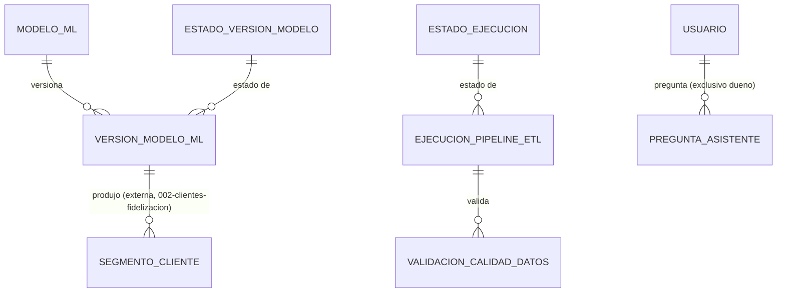

# Modelo de Datos: Analítica y Reportes (BI)

**Feature**: `011-analitica-reportes` | **Fecha**: 2026-09-04
**Origen**: `spec.md` (entidades clave) + `research.md` (Decisiones 1-5)

## Diagrama de relaciones

`USUARIO` es propiedad de `010-administracion`, referenciado aquí solo por FK. `VERSION_MODELO_ML` no tiene relación con otras tablas de este módulo — cada modelo es independiente entre sí y respecto al pipeline ETL (un modelo puede reentrenarse sin que corra un nuevo ciclo ETL completo).

## Catálogos maestros *(añadidos en enmienda v1.1 — normalización de catálogos)*

Clave natural en los tres. Seed dentro de la misma migración.

### `modelo_ml`

| Campo | Tipo | Restricciones |
|---|---|---|
| codigo | VARCHAR(40) | PK — `'demanda'`, `'pricing'`, `'churn'`, `'anomalias_caja'`, `'segmentacion_clientes'` |
| etiqueta | VARCHAR(80) | NOT NULL |
| algoritmo | VARCHAR(60) | NOT NULL — p. ej. `'Isolation Forest'`, `'K-Means'` |
| metrica_principal | VARCHAR(40) | NOT NULL — `'MAE'`, `'F1'`, `'silhouette'`, según el modelo |
| tamano_muestra_minimo | INTEGER | NOT NULL, CHECK (tamano_muestra_minimo > 0) — umbral bajo el cual la versión se descarta (Art. 5.9) |
| modulo_consumidor | VARCHAR(60) | NOT NULL — el módulo de `specs/` que consume sus resultados |
| orden | SMALLINT | NOT NULL, DEFAULT 0 |
| activo | BOOLEAN | NOT NULL, DEFAULT true |

`metrica_principal` cierra un hueco real: hoy `version_modelo_ml.nombre_metrica` es TEXT libre, así que **nada impide registrar el modelo de churn con una métrica de silueta**, que es de clustering y no significa nada para una clasificación. Peor aún, comparar el desempeño de dos versiones del mismo modelo exige que ambas usen la misma métrica, y sin catálogo eso solo se cumple por disciplina. Habilita RN-AR-004.

`algoritmo` y `modulo_consumidor` hacen consultable lo que hoy solo está en la constitución (Art. 5.6) y en los `research.md` de los módulos: qué algoritmo usa cada modelo y quién consume su salida. Es lo que permite responder "si retiro este modelo, ¿qué se rompe?" sin leer los 11 documentos.

**`tamano_muestra_minimo` es el hallazgo más útil de esta enmienda en este módulo.** La Decisión 3 original estableció, con buen criterio, que el umbral debe ser **por modelo** y no un CHECK genérico, y lo puso en un diccionario `UMBRAL_MINIMO_POR_MODELO` dentro de `services/analitica.py`. El razonamiento sigue siendo correcto; lo que cambia es dónde vive el dato.

Un umbral es exactamente el tipo de parámetro que el Art. 5.9 exige poder auditar: la regla dice que si los datos no alcanzan, el informe no se implementa y **se documenta por qué**. Con el umbral en el código, la respuesta a "¿por qué se descartó esta versión?" está en un archivo Python; con el umbral en el catálogo, está en la misma base que la versión descartada, junto a su `motivo`. La Decisión 3 se mantiene intacta en su fondo (umbral por modelo, no CHECK genérico); solo se mueve del diccionario al catálogo, donde además puede ajustarse por migración con trazabilidad.

Los cinco códigos son los mismos cinco modelos del Art. 5.6 — el catálogo no abre la puerta a un sexto sin enmendar la constitución, solo deja de tenerlos escritos dentro de un CHECK.

### `estado_ejecucion`

| Campo | Tipo | Restricciones |
|---|---|---|
| codigo | VARCHAR(40) | PK — `'en_progreso'`, `'exitoso'`, `'error'` |
| etiqueta | VARCHAR(80) | NOT NULL |
| es_estado_final | BOOLEAN | NOT NULL — `false` solo en `en_progreso` |
| orden | SMALLINT | NOT NULL, DEFAULT 0 |
| activo | BOOLEAN | NOT NULL, DEFAULT true |

### `estado_version_modelo`

| Campo | Tipo | Restricciones |
|---|---|---|
| codigo | VARCHAR(60) | PK — `'activo'`, `'reemplazado'`, `'descartado_datos_insuficientes'` |
| etiqueta | VARCHAR(80) | NOT NULL |
| es_version_servible | BOOLEAN | NOT NULL — `true` solo en `activo` |
| exige_motivo | BOOLEAN | NOT NULL — `true` solo en `descartado_datos_insuficientes` |
| orden | SMALLINT | NOT NULL, DEFAULT 0 |
| activo | BOOLEAN | NOT NULL, DEFAULT true |

`es_version_servible` saca del código la regla de qué versión responde consultas: solo la activa. Una versión `descartado_datos_insuficientes` existe como registro de honestidad (Art. 5.9 — se documenta que no se pudo entrenar), no como algo que sirva predicciones.

`exige_motivo` expresa como dato el CHECK que ya existe en `version_modelo_ml`. El CHECK **se mantiene**: impone la regla fila por fila en la base, mientras que la columna del catálogo solo la hace consultable para los formularios — mismo criterio que en `005-promociones-inteligentes` con RN-PI-002.

## Tablas

### `ejecucion_pipeline_etl`

| Campo | Tipo | Restricciones |
|---|---|---|
| id | BIGSERIAL | PK |
| dag_run_id | TEXT | NOT NULL, UNIQUE — id de la corrida de Airflow |
| fecha_inicio | TIMESTAMPTZ | NOT NULL |
| fecha_fin | TIMESTAMPTZ | NULL — NULL mientras `estado='en_progreso'` |
| estado | VARCHAR(40) | NOT NULL, FK → estado_ejecucion(codigo) — *enmienda v1.1, antes era CHECK IN (...)* |
| sucursales_procesadas | INTEGER | NOT NULL, DEFAULT 0 |
| filas_cargadas | INTEGER | NOT NULL, DEFAULT 0 |
| mensaje_error | TEXT | NULL |

Índice: `(fecha_inicio DESC)` — soporta "último ciclo" (OO-AR02) vía `ORDER BY fecha_inicio DESC LIMIT 1`. Append-only: un DAG en curso se registra al iniciar y se actualiza una única vez al finalizar (no es una violación del patrón append-only del resto del proyecto porque representa un único evento de negocio con dos fases, igual que `orden_compra.estado` se deriva de eventos de `recepcion_orden_compra` en `008` — aquí el evento "ejecución de pipeline" tiene su propio ciclo de vida corto, cerrado por diseño).

### `validacion_calidad_datos`

| Campo | Tipo | Restricciones |
|---|---|---|
| id | BIGSERIAL | PK |
| ejecucion_id | BIGINT | NOT NULL, FK → ejecucion_pipeline_etl |
| regla_validada | TEXT | NOT NULL — p. ej. `'sin_producto_id_nulo'`, `'totales_cuadran_vs_postgres'` |
| aprobado | BOOLEAN | NOT NULL |
| detalle | TEXT | NULL |
| fecha | TIMESTAMPTZ | NOT NULL, DEFAULT now() |

Índice: `(ejecucion_id)`. Append-only.

### `version_modelo_ml`

| Campo | Tipo | Restricciones |
|---|---|---|
| id | BIGSERIAL | PK |
| modelo | VARCHAR(40) | NOT NULL, FK → modelo_ml(codigo) — *enmienda v1.1, antes era CHECK IN (...)* |
| version | TEXT | NOT NULL — p. ej. `'2026.09.04-a'` |
| estado | VARCHAR(60) | NOT NULL, FK → estado_version_modelo(codigo) — *enmienda v1.1* |
| tamano_muestra | INTEGER | NOT NULL — RNF-AR-002, Art. 5.9 |
| periodo_inicio | DATE | NOT NULL |
| periodo_fin | DATE | NOT NULL |
| nombre_metrica | VARCHAR(40) | NOT NULL — DEBE coincidir con `modelo_ml.metrica_principal` del modelo indicado (RN-AR-004, *enmienda v1.1*); antes era TEXT libre, así que nada impedía registrar el modelo de churn con una métrica de clustering |
| valor_metrica | NUMERIC(10,4) | NULL — NULL si `estado='descartado_datos_insuficientes'` |
| motivo | TEXT | NULL, CHECK (estado != 'descartado_datos_insuficientes' OR motivo IS NOT NULL) |
| fecha_entrenamiento | TIMESTAMPTZ | NOT NULL, DEFAULT now() |

Restricción adicional: **índice único parcial** `UNIQUE (modelo) WHERE estado = 'activo'` — impone RN-AR-001 (una sola versión activa por modelo a la vez), mismo patrón de índice parcial que `turno_caja` en `006-caja-mermas-fraude` y `recomendacion_precio` en `003-precios-margenes` (Decisión 2 de `research.md`). Append-only: activar una versión nueva marca la anterior como `reemplazado` en la misma transacción, nunca se borra.

### `pregunta_asistente`

| Campo | Tipo | Restricciones |
|---|---|---|
| id | BIGSERIAL | PK |
| usuario_id | BIGINT | NOT NULL, FK → usuario (externa, `010-administracion`) — RNF-AR-003 exige que el rol de este usuario sea `dueno`, validado en servicio |
| pregunta_texto | TEXT | NOT NULL |
| consulta_generada | TEXT | NOT NULL, CHECK (consulta_generada != '') — RN-AR-003 |
| respuesta_texto | TEXT | NOT NULL |
| fecha | TIMESTAMPTZ | NOT NULL, DEFAULT now() |

Índice: `(usuario_id, fecha DESC)`. Append-only, mismo criterio de auditoría inmutable que `log_auditoria` de `010-administracion`, pero con su propia tabla porque el contenido (pregunta/consulta/respuesta en lenguaje natural) no encaja en la forma genérica `accion/recurso/recurso_id` de `log_auditoria`.

## Notas de integridad transversales *(enmienda v1.1)*

- Ninguno de los tres catálogos se borra; baja lógica con `activo = false`. Las versiones históricas de modelo deben conservar el significado de su modelo y su estado — son el registro de honestidad del Art. 5.9.
- `modelo_ml` es consumido desde fuera del módulo: `segmento_cliente` de `002-clientes-fidelizacion` referencia `version_modelo_ml.id` (enmienda v1.1 de ese módulo), así que dar de baja un modelo o alterar su código rompería esa trazabilidad.
- `validacion_calidad_datos.regla_validada` **sigue siendo TEXT libre** a propósito: lo escribe el propio DAG y crece con cada regla nueva de validación. Catalogarlo obligaría a una migración cada vez que se agrega una comprobación de calidad — el mismo argumento que deja `log_auditoria.accion` sin catálogo en `010-administracion`.
- Los tres catálogos son de solo lectura desde la API: se siembran por migración. Agregar un sexto modelo exigiría además enmendar el Art. 5.6 de la constitución, no solo insertar una fila.
