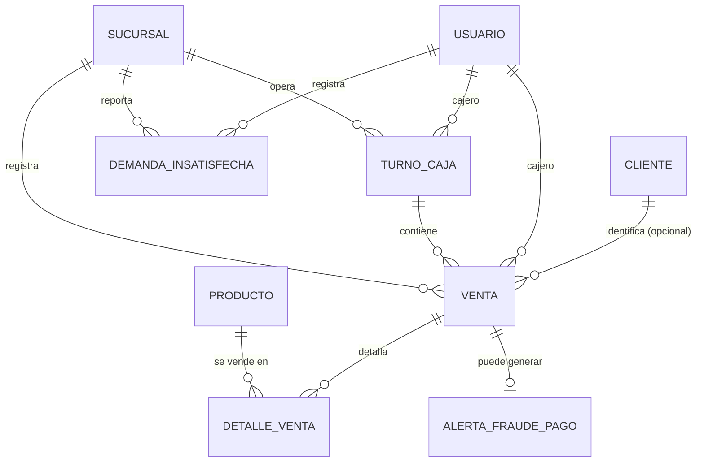

# Modelo de Datos: Ventas y Caja

**Feature**: `001-ventas-y-caja` | **Fecha**: 2026-09-04
**Origen**: `spec.md` (entidades clave) + `research.md` (Decisiones 1-3)

## Diagrama de relaciones

`PRODUCTO`, `SUCURSAL`, `USUARIO` y `CLIENTE` son entidades propiedad de otros módulos (Inventario y Caducidad, Expansión y Sucursales, Administración, Fidelización y Clientes respectivamente) — aquí solo se referencian por FK.

## Tablas

### `venta`

| Campo | Tipo | Restricciones |
|---|---|---|
| id | BIGSERIAL | PK |
| sucursal_id | BIGINT | NOT NULL, FK → sucursal |
| turno_caja_id | BIGINT | NOT NULL, FK → turno_caja (Decisión 2 de `research.md`) |
| cajero_id | BIGINT | NOT NULL, FK → usuario |
| cliente_id | BIGINT | NULL, FK → cliente (venta puede ser anónima) |
| fecha_hora | TIMESTAMPTZ | NOT NULL, DEFAULT now() |
| subtotal | NUMERIC(10,2) | NOT NULL, CHECK (subtotal >= 0) |
| descuento_aplicado | NUMERIC(10,2) | NOT NULL, DEFAULT 0, CHECK (descuento_aplicado >= 0) |
| iva | NUMERIC(10,2) | NOT NULL, CHECK (iva >= 0) — calculado sobre (subtotal − descuento_aplicado) × 0.15, Art. 4.1 |
| total | NUMERIC(10,2) | NOT NULL, CHECK (total = subtotal − descuento_aplicado + iva) |
| metodo_pago | TEXT | NOT NULL, CHECK IN ('efectivo','tarjeta','electronico') — Decisión 3: un único método por venta |
| estado_pago | TEXT | NOT NULL, DEFAULT 'pendiente', CHECK IN ('pendiente','aprobado','rechazado') |
| estado_venta | TEXT | NOT NULL, DEFAULT 'completada', CHECK IN ('completada','anulada') |
| motivo_anulacion | TEXT | NULL — CHECK (estado_venta <> 'anulada' OR motivo_anulacion IS NOT NULL), RF-VC-004 |
| anulada_en | TIMESTAMPTZ | NULL |

Índices: `(sucursal_id, fecha_hora)`, `(turno_caja_id)`.

### `detalle_venta`

| Campo | Tipo | Restricciones |
|---|---|---|
| id | BIGSERIAL | PK |
| venta_id | BIGINT | NOT NULL, FK → venta |
| producto_id | BIGINT | NOT NULL, FK → producto |
| cantidad_venta | NUMERIC(10,3) | NOT NULL, CHECK (cantidad_venta > 0) — en la unidad de venta del producto |
| unidad_venta | TEXT | NOT NULL — snapshot de `producto.unidad_venta` al momento de la venta |
| cantidad_inventario | NUMERIC(10,3) | NOT NULL — ya convertida vía `factor_conversion` (Decisión 1); es la cantidad que se descuenta del stock |
| precio_unitario_aplicado | NUMERIC(10,2) | NOT NULL — snapshot del precio vigente al momento de la venta, nunca se recalcula con el precio actual |
| subtotal_item | NUMERIC(10,2) | NOT NULL, CHECK (subtotal_item = cantidad_venta × precio_unitario_aplicado) |

Índices: `(venta_id)`, `(producto_id)`.

**Regla de negocio aplicada (RN-VC-001):** la API rechaza (HTTP 422) la creación de un `detalle_venta` de un producto con `producto.es_fraccionable = true` si `producto.factor_conversion IS NULL` — la validación ocurre en el servicio, no solo en la base de datos, para devolver un mensaje claro al cajero.

### `turno_caja`

| Campo | Tipo | Restricciones |
|---|---|---|
| id | BIGSERIAL | PK |
| sucursal_id | BIGINT | NOT NULL, FK → sucursal |
| cajero_id | BIGINT | NOT NULL, FK → usuario |
| hora_apertura | TIMESTAMPTZ | NOT NULL, DEFAULT now() |
| monto_inicial | NUMERIC(10,2) | NOT NULL, CHECK (monto_inicial >= 0) |
| hora_cierre | TIMESTAMPTZ | NULL |
| monto_contado | NUMERIC(10,2) | NULL, CHECK (monto_contado >= 0) — obligatorio al cerrar, RF-VC-012 |
| monto_esperado | NUMERIC(10,2) | NULL — calculado y guardado SOLO al cerrar (Decisión 2 de `research.md`: se recalcula desde `venta`, nunca es un contador vivo) |
| diferencia | NUMERIC(10,2) | GENERATED ALWAYS AS (monto_contado - monto_esperado) STORED |
| motivo_diferencia | TEXT | NULL — CHECK (estado <> 'cerrado' OR diferencia = 0 OR motivo_diferencia IS NOT NULL), RF-VC-008 |
| estado | TEXT | NOT NULL, DEFAULT 'abierto', CHECK IN ('abierto','cerrado') |

Restricción adicional: **índice único parcial** `UNIQUE (cajero_id) WHERE estado = 'abierto'` — un cajero no puede tener dos turnos abiertos a la vez (se infiere de RF-VC-006/007, necesario para que el cálculo de `monto_esperado` por turno sea inequívoco).

Índices: `(sucursal_id, estado)`.

### `demanda_insatisfecha`

| Campo | Tipo | Restricciones |
|---|---|---|
| id | BIGSERIAL | PK |
| sucursal_id | BIGINT | NOT NULL, FK → sucursal |
| producto_id | BIGINT | NOT NULL, FK → producto |
| cajero_id | BIGINT | NOT NULL, FK → usuario |
| hora_evento | TIMESTAMPTZ | NOT NULL — puede diferir de `hora_registro` (caso límite de `spec.md`) |
| hora_registro | TIMESTAMPTZ | NOT NULL, DEFAULT now() |

Índices: `(sucursal_id, producto_id, hora_evento)` — es el índice que usará el modelo de pronóstico de demanda (OT4.1) al entrenar.

### `alerta_fraude_pago`

| Campo | Tipo | Restricciones |
|---|---|---|
| id | BIGSERIAL | PK |
| venta_id | BIGINT | NOT NULL, FK → venta |
| motivo | TEXT | NOT NULL |
| estado | TEXT | NOT NULL, DEFAULT 'abierta', CHECK IN ('abierta','atendida') |
| ultimos_4_digitos | CHAR(4) | NULL — NUNCA el número completo de tarjeta (Art. 10.8) |
| codigo_respuesta_proveedor | TEXT | NULL — respuesta del proveedor sandbox (Art. 8.2), no un dato bancario real |
| creada_en | TIMESTAMPTZ | NOT NULL, DEFAULT now() |
| atendida_en | TIMESTAMPTZ | NULL |
| atendida_por | BIGINT | NULL, FK → usuario |

Índices: `(estado)`.

## Notas de integridad transversales

- Ninguna tabla de este módulo permite `DELETE` desde la aplicación — todo es INSERT o UPDATE de estado (append-mostly), coherente con Art. 10.5 de auditoría y con RNF-VC-003 de `spec.md`.
- `detalle_venta.precio_unitario_aplicado` y `unidad_venta` son snapshots deliberados: si el precio o la unidad de venta del producto cambian después, el historial de ventas pasadas no debe verse afectado — mismo principio que evitó (en su formulación correcta) el bug de NexoStay donde dos partes del sistema representaban la misma cifra de forma inconsistente.
