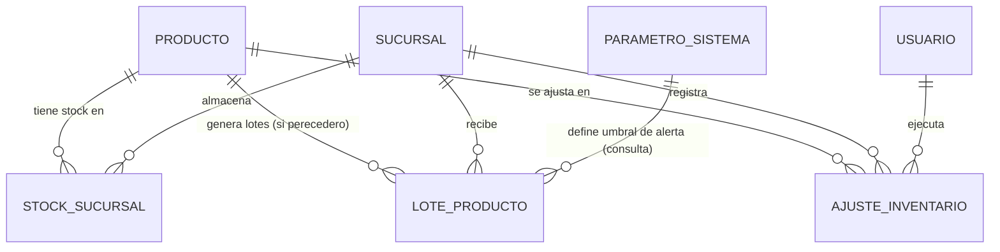

# Modelo de Datos: Inventario y Caducidad

**Feature**: `002-inventario-caducidad` | **Fecha**: 2026-09-04
**Origen**: `spec.md` (entidades clave) + `research.md` (Decisiones 1-3)

## Diagrama de relaciones

`SUCURSAL` y `USUARIO` son entidades propiedad de otros módulos (Expansión y Sucursales, Administración). `PARAMETRO_SISTEMA` es propiedad de Administración (OO-AD07) — este módulo solo lo consulta, nunca lo escribe.

## Tablas

### `producto`

| Campo | Tipo | Restricciones |
|---|---|---|
| id | BIGSERIAL | PK |
| nombre | TEXT | NOT NULL |
| categoria | TEXT | NOT NULL |
| codigo_barras | TEXT | NULL, UNIQUE |
| unidad_venta | TEXT | NOT NULL — ej. 'unidad', 'libra', 'litro' |
| unidad_inventario | TEXT | NOT NULL — ej. 'unidad', 'kg', 'litro' |
| es_fraccionable | BOOLEAN | NOT NULL, DEFAULT false |
| factor_conversion | NUMERIC(10,4) | NULL, CHECK (es_fraccionable = false OR factor_conversion IS NOT NULL) — RN-IN-002, Decisión 1 |
| es_perecedero | BOOLEAN | NOT NULL, DEFAULT false |
| activo | BOOLEAN | NOT NULL, DEFAULT true |
| creado_en | TIMESTAMPTZ | NOT NULL, DEFAULT now() |

Índices: `(codigo_barras)` único, `(categoria)`.

### `stock_sucursal`

| Campo | Tipo | Restricciones |
|---|---|---|
| id | BIGSERIAL | PK |
| producto_id | BIGINT | NOT NULL, FK → producto |
| sucursal_id | BIGINT | NOT NULL, FK → sucursal |
| cantidad_disponible | NUMERIC(10,3) | NOT NULL, DEFAULT 0, CHECK (cantidad_disponible >= 0) — RN-IN-001 |
| dias_sin_venta | INTEGER | NOT NULL, DEFAULT 0 — actualizado por el proceso batch de rotación |
| marcado_sin_rotacion | BOOLEAN | NOT NULL, DEFAULT false — OO-IN08, escrito solo por Sistema |
| actualizado_en | TIMESTAMPTZ | NOT NULL, DEFAULT now() |

Restricción adicional: **único** `(producto_id, sucursal_id)` — un solo registro de stock agregado por combinación producto/sucursal (RNF-IN-002).

Índices: `(sucursal_id, marcado_sin_rotacion)` — usado por OO-IN09.

### `lote_producto`

| Campo | Tipo | Restricciones |
|---|---|---|
| id | BIGSERIAL | PK |
| producto_id | BIGINT | NOT NULL, FK → producto |
| sucursal_id | BIGINT | NOT NULL, FK → sucursal |
| fecha_caducidad | DATE | NOT NULL |
| cantidad_lote | NUMERIC(10,3) | NOT NULL, CHECK (cantidad_lote > 0) |
| cantidad_restante | NUMERIC(10,3) | NOT NULL, CHECK (cantidad_restante >= 0 AND cantidad_restante <= cantidad_lote) |
| fecha_ingreso | TIMESTAMPTZ | NOT NULL, DEFAULT now() |
| retirado_en | TIMESTAMPTZ | NULL — se llena cuando `cantidad_restante` llega a 0 por retiro (OO-IN05) |
| motivo_retiro | TEXT | NULL |

Índices: `(sucursal_id, fecha_caducidad)` — es el índice que usa la consulta de "próximos a caducar" (OO-IN04).

**Nota de integridad (Decisión 2 de `research.md`):** la aplicación DEBE validar en el servicio que `producto_id` referenciado tenga `es_perecedero = true` antes de insertar un `lote_producto` — PostgreSQL no permite un CHECK que consulte otra tabla directamente, así que esta regla vive en `backend/app/services/inventario.py`, no solo en el esquema.

### `ajuste_inventario`

| Campo | Tipo | Restricciones |
|---|---|---|
| id | BIGSERIAL | PK |
| producto_id | BIGINT | NOT NULL, FK → producto |
| sucursal_id | BIGINT | NOT NULL, FK → sucursal |
| cantidad_ajuste | NUMERIC(10,3) | NOT NULL — puede ser positivo (sobrante) o negativo (faltante) |
| motivo | TEXT | NOT NULL, CHECK (length(motivo) >= 3) — RF-IN-008 |
| usuario_id | BIGINT | NOT NULL, FK → usuario |
| fecha | TIMESTAMPTZ | NOT NULL, DEFAULT now() |

Índices: `(producto_id, sucursal_id, fecha)`.

**Regla de negocio aplicada (RF-IN-009):** el servicio que procesa un `ajuste_inventario` recalcula `stock_sucursal.cantidad_disponible + cantidad_ajuste` y rechaza la operación con `422` si el resultado es negativo, antes de escribir cualquier fila — la misma disciplina de "validar antes de persistir" que usó Ventas y Caja para `factor_conversion`.

## Notas de integridad transversales

- Ninguna tabla de este módulo permite `DELETE` desde la aplicación: un producto se da de baja con `activo = false`, un lote se cierra con `retirado_en`, nunca se elimina físicamente — necesario porque Compras, Precios y Analítica referencian estos IDs en su propio historial.
- `stock_sucursal.cantidad_disponible` es el agregado que consulta Ventas y Caja en cada venta (RF-IN-007); `lote_producto` es información adicional para gestión de caducidad, pero **nunca** es la fuente de verdad del stock total — evita que una discrepancia entre lotes y el agregado bloquee una venta válida.
