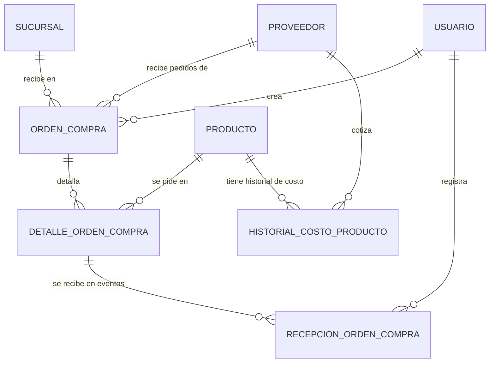

# Modelo de Datos: Compras y Proveedores

**Feature**: `003-compras-proveedores` | **Fecha**: 2026-09-04
**Origen**: `spec.md` (entidades clave) + `research.md` (Decisiones 1-3)

## Diagrama de relaciones

`PRODUCTO` es propiedad de Inventario y Caducidad (`002-inventario-caducidad`); `SUCURSAL` y `USUARIO` son propiedad de Expansión y Sucursales / Administración.

## Tablas

### `proveedor`

| Campo | Tipo | Restricciones |
|---|---|---|
| id | BIGSERIAL | PK |
| nombre | TEXT | NOT NULL |
| contacto | TEXT | NULL — teléfono o correo |
| activo | BOOLEAN | NOT NULL, DEFAULT true |
| creado_en | TIMESTAMPTZ | NOT NULL, DEFAULT now() |

### `orden_compra`

| Campo | Tipo | Restricciones |
|---|---|---|
| id | BIGSERIAL | PK |
| proveedor_id | BIGINT | NOT NULL, FK → proveedor |
| sucursal_id | BIGINT | NOT NULL, FK → sucursal |
| creado_por | BIGINT | NOT NULL, FK → usuario |
| fecha_pedido | TIMESTAMPTZ | NOT NULL, DEFAULT now() |
| es_oferta | BOOLEAN | NOT NULL, DEFAULT false |
| estado | TEXT | NOT NULL, DEFAULT 'pendiente', CHECK IN ('pendiente','recibida_parcial','recibida_completa','cancelada') — **derivado**, nunca editable directamente (RNF-CP-001, Decisión 1) |

Índices: `(proveedor_id)`, `(sucursal_id, estado)`.

### `detalle_orden_compra`

| Campo | Tipo | Restricciones |
|---|---|---|
| id | BIGSERIAL | PK |
| orden_compra_id | BIGINT | NOT NULL, FK → orden_compra |
| producto_id | BIGINT | NOT NULL, FK → producto |
| cantidad_pedida | NUMERIC(10,3) | NOT NULL, CHECK (cantidad_pedida > 0) |
| precio_ofrecido | NUMERIC(10,2) | NOT NULL, CHECK (precio_ofrecido >= 0) |
| pronostico_consultado | BOOLEAN | NOT NULL, DEFAULT false — RN-CP-001 |
| cantidad_recomendada_pronostico | NUMERIC(10,3) | NULL — snapshot de la recomendación consultada, solo si `pronostico_consultado = true` |
| motivo_no_siguio_pronostico | TEXT | NULL — CHECK (cantidad_recomendada_pronostico IS NULL OR cantidad_pedida <= cantidad_recomendada_pronostico OR motivo_no_siguio_pronostico IS NOT NULL) |

Índices: `(orden_compra_id)`, `(producto_id)`.

**Nota:** `cantidad_recibida` NO es una columna de esta tabla — es un valor calculado por el servicio (`SUM(recepcion_orden_compra.cantidad_recibida_evento)` filtrado por `detalle_orden_compra_id`), expuesto en las respuestas de la API pero nunca persistido como columna editable (Decisión 1).

### `recepcion_orden_compra`

| Campo | Tipo | Restricciones |
|---|---|---|
| id | BIGSERIAL | PK |
| detalle_orden_compra_id | BIGINT | NOT NULL, FK → detalle_orden_compra |
| cantidad_recibida_evento | NUMERIC(10,3) | NOT NULL, CHECK (cantidad_recibida_evento > 0) |
| fecha_recepcion | TIMESTAMPTZ | NOT NULL, DEFAULT now() |
| usuario_id | BIGINT | NOT NULL, FK → usuario |

Índices: `(detalle_orden_compra_id, fecha_recepcion)`.

**Regla de negocio aplicada:** cada `INSERT` en esta tabla dispara, dentro de la misma transacción del servicio, la creación de un `historial_costo_producto` (RF-CP-006) y la reevaluación del `estado` de la `orden_compra` correspondiente (RF-CP-005).

### `historial_costo_producto`

| Campo | Tipo | Restricciones |
|---|---|---|
| id | BIGSERIAL | PK |
| producto_id | BIGINT | NOT NULL, FK → producto |
| proveedor_id | BIGINT | NOT NULL, FK → proveedor |
| costo | NUMERIC(10,2) | NOT NULL, CHECK (costo >= 0) |
| orden_compra_id | BIGINT | NOT NULL, FK → orden_compra |
| fecha | TIMESTAMPTZ | NOT NULL, DEFAULT now() |

Índices: `(producto_id, proveedor_id, fecha)` — soporta tanto el historial de variación (OO-CP05) como la comparación entre proveedores (OO-CP06, Decisión 2, vía `DISTINCT ON (proveedor_id) ORDER BY fecha DESC`).

## Notas de integridad transversales

- `historial_costo_producto` es estrictamente append-only (RNF-CP-002): ningún endpoint de este módulo expone un `UPDATE` o `DELETE` sobre esta tabla.
- El `estado` de `orden_compra` se recalcula por servicio, no por trigger de base de datos, para poder aplicar en el mismo paso la validación de RN-CP-001 (que necesita leer `detalle_orden_compra.pronostico_consultado`) antes de permitir el avance de estado.
- `producto_id` y `sucursal_id` de este módulo son siempre FK hacia tablas de otros módulos (`002-inventario-caducidad`, `007-expansion-sucursales` pendiente) — este módulo nunca duplica su definición.
