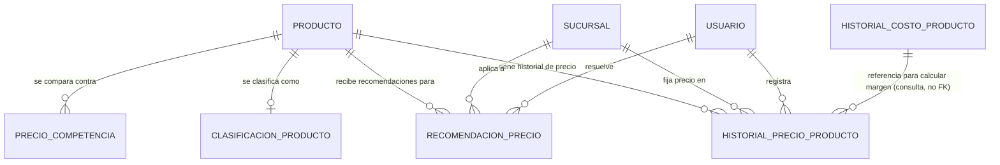

# Modelo de Datos: Precios y Márgenes

**Feature**: `004-precios-margenes` | **Fecha**: 2026-09-04
**Origen**: `spec.md` (entidades clave) + `research.md` (Decisiones 1-3)

## Diagrama de relaciones

`PRODUCTO` es propiedad de Inventario y Caducidad (`002-inventario-caducidad`); `HISTORIAL_COSTO_PRODUCTO` es propiedad de Compras y Proveedores (`003-compras-proveedores`) — este módulo lo consulta para calcular el margen real, pero nunca lo modifica. `SUCURSAL` y `USUARIO` son propiedad de Expansión y Sucursales / Administración.

## Tablas

### `historial_precio_producto`

| Campo | Tipo | Restricciones |
|---|---|---|
| id | BIGSERIAL | PK |
| producto_id | BIGINT | NOT NULL, FK → producto |
| sucursal_id | BIGINT | NOT NULL, FK → sucursal |
| precio_venta | NUMERIC(10,2) | NOT NULL, CHECK (precio_venta >= 0) |
| fuente | TEXT | NOT NULL, CHECK IN ('manual','motor_dinamico') |
| vigente_desde | TIMESTAMPTZ | NOT NULL, DEFAULT now() |
| registrado_por | BIGINT | NOT NULL, FK → usuario — quien hizo el cambio manual, o quien aceptó la recomendación |

Índices: `(producto_id, sucursal_id, vigente_desde DESC)` — soporta tanto la consulta de precio vigente (Decisión 1) como el historial completo para el KPI trimestral de OT1.1.

### `clasificacion_producto`

| Campo | Tipo | Restricciones |
|---|---|---|
| producto_id | BIGINT | PK, FK → producto — una sola clasificación vigente por producto, a nivel de cadena (Decisión 2) |
| clasificacion | TEXT | NOT NULL, CHECK IN ('gancho','nicho') |
| actualizado_en | TIMESTAMPTZ | NOT NULL, DEFAULT now() |
| actualizado_por | BIGINT | NOT NULL, FK → usuario |

### `precio_competencia`

| Campo | Tipo | Restricciones |
|---|---|---|
| id | BIGSERIAL | PK |
| producto_id | BIGINT | NOT NULL, FK → producto |
| fuente | TEXT | NOT NULL — nombre de la tienda/canal de competencia observado |
| precio_referencia | NUMERIC(10,2) | NOT NULL, CHECK (precio_referencia >= 0) |
| fecha_registro | TIMESTAMPTZ | NOT NULL, DEFAULT now() |
| registrado_por | BIGINT | NOT NULL, FK → usuario |

Índices: `(producto_id, fecha_registro DESC)`.

### `recomendacion_precio`

| Campo | Tipo | Restricciones |
|---|---|---|
| id | BIGSERIAL | PK |
| producto_id | BIGINT | NOT NULL, FK → producto |
| sucursal_id | BIGINT | NOT NULL, FK → sucursal |
| precio_actual_snapshot | NUMERIC(10,2) | NOT NULL — precio vigente al momento de generar la recomendación |
| precio_recomendado | NUMERIC(10,2) | NOT NULL, CHECK (precio_recomendado >= 0) |
| justificacion | TEXT | NOT NULL, CHECK (length(justificacion) >= 10) — el modelo debe explicar qué factores consideró (Art. 5.9, ninguna cifra sin justificación) |
| estado | TEXT | NOT NULL, DEFAULT 'pendiente', CHECK IN ('pendiente','aceptada','rechazada','obsoleta') |
| fecha_generada | TIMESTAMPTZ | NOT NULL, DEFAULT now() |
| fecha_resolucion | TIMESTAMPTZ | NULL |
| resuelto_por | BIGINT | NULL, FK → usuario |

Restricción adicional: **índice único parcial** `UNIQUE (producto_id, sucursal_id) WHERE estado = 'pendiente'` — impone RN-PM-001 (nunca dos recomendaciones pendientes simultáneas para el mismo producto/sucursal), mismo patrón de índice parcial que ya usó `turno_caja` en `001-ventas-y-caja` para un problema distinto (evitar dos turnos de caja abiertos), reutilizado aquí porque el problema estructural es análogo: un solo estado "activo" permitido a la vez por combinación de claves.

Índices: `(sucursal_id, estado)`.

## Notas de integridad transversales

- `historial_precio_producto` y `precio_competencia` son estrictamente append-only: ningún router de este módulo expone `UPDATE`/`DELETE` sobre ellas (RNF-PM-002).
- El margen real (RF-PM-003) es un valor **calculado en el momento de la consulta**, combinando el precio vigente de este módulo con el costo vigente de `historial_costo_producto` (Compras) — no se materializa ni se cachea en una tabla propia, para no arriesgarse a que quede desactualizado frente a cualquiera de las dos fuentes.
- Cuando se registra un precio manual (RF-PM-001) para un producto/sucursal que tiene una `recomendacion_precio` en estado `pendiente`, el servicio la marca `obsoleta` en la misma transacción (caso límite de `spec.md`).
