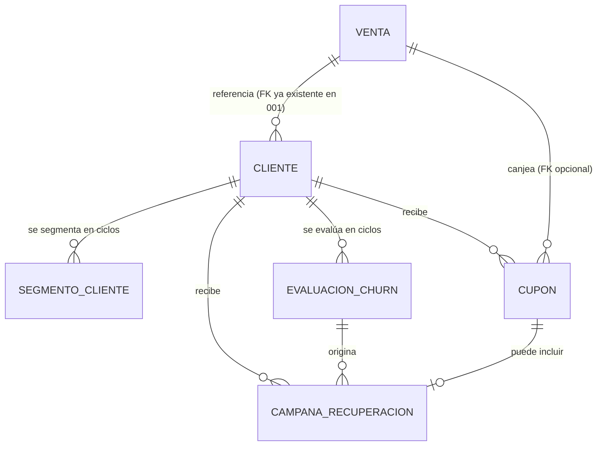

# Modelo de Datos: Fidelización y Clientes

**Feature**: `005-fidelizacion-clientes` | **Fecha**: 2026-09-04
**Origen**: `spec.md` (entidades clave) + `research.md` (Decisiones 1-3)

## Diagrama de relaciones

`VENTA` es propiedad de Ventas y Caja (`001-ventas-y-caja`) — este módulo solo la consulta (RNF-FC-002); el FK `venta.cliente_id` ya existe desde el `data-model.md` de ese módulo, apuntando hacia `cliente` definido aquí.

## Tablas

### `cliente`

| Campo | Tipo | Restricciones |
|---|---|---|
| id | BIGSERIAL | PK |
| nombre | TEXT | NOT NULL |
| contacto | TEXT | NULL — teléfono o correo |
| fecha_nacimiento | DATE | NULL |
| creado_en | TIMESTAMPTZ | NOT NULL, DEFAULT now() |

Índices: `(fecha_nacimiento)` — usado por el proceso de cupones de cumpleaños (extrae mes/día).

### `segmento_cliente`

| Campo | Tipo | Restricciones |
|---|---|---|
| id | BIGSERIAL | PK |
| cliente_id | BIGINT | NOT NULL, FK → cliente |
| segmento | TEXT | NOT NULL — etiqueta que produce el modelo K-Means (ej. 'alto_valor', 'frecuente', 'ocasional') |
| frecuencia_snapshot | NUMERIC(10,2) | NULL — compras/mes usado por el modelo en este ciclo |
| margen_snapshot | NUMERIC(10,2) | NULL — margen generado por el cliente en el periodo |
| recencia_dias_snapshot | INTEGER | NULL — días desde la última compra al momento del cálculo |
| tamano_muestra | INTEGER | NOT NULL, CHECK (tamano_muestra > 0) — clientes considerados en este ciclo (Art. 5.9) |
| periodo_inicio | DATE | NOT NULL |
| periodo_fin | DATE | NOT NULL |
| fecha_calculo | TIMESTAMPTZ | NOT NULL, DEFAULT now() |

Índices: `(cliente_id, fecha_calculo DESC)` — soporta obtener el segmento más reciente (Decisión 2).

### `evaluacion_churn`

| Campo | Tipo | Restricciones |
|---|---|---|
| id | BIGSERIAL | PK |
| cliente_id | BIGINT | NOT NULL, FK → cliente |
| es_riesgo_real | BOOLEAN | NOT NULL |
| dias_sin_compra_al_momento | INTEGER | NOT NULL, CHECK (dias_sin_compra_al_momento >= 0) |
| frecuencia_historica_dias | NUMERIC(10,2) | NULL — ciclo de compra normal propio de ese cliente, el dato que evita el umbral fijo de 30 días |
| justificacion | TEXT | NOT NULL, CHECK (length(justificacion) >= 10) — Art. 5.9 |
| tamano_muestra | INTEGER | NOT NULL, CHECK (tamano_muestra > 0) |
| fecha_evaluacion | TIMESTAMPTZ | NOT NULL, DEFAULT now() |

Índices: `(cliente_id, fecha_evaluacion DESC)`.

### `cupon`

| Campo | Tipo | Restricciones |
|---|---|---|
| id | BIGSERIAL | PK |
| cliente_id | BIGINT | NOT NULL, FK → cliente |
| tipo_origen | TEXT | NOT NULL, CHECK IN ('cumpleanos','patron_compra','recuperacion_churn') — Decisión 1 |
| evaluacion_churn_id | BIGINT | NULL, FK → evaluacion_churn — solo si `tipo_origen = 'recuperacion_churn'` |
| codigo | TEXT | NOT NULL, UNIQUE |
| descuento_tipo | TEXT | NOT NULL, CHECK IN ('porcentaje','monto_fijo') |
| descuento_valor | NUMERIC(10,2) | NOT NULL, CHECK (descuento_valor >= 0) |
| fecha_envio | TIMESTAMPTZ | NOT NULL, DEFAULT now() |
| fecha_expiracion | TIMESTAMPTZ | NOT NULL |
| estado | TEXT | NOT NULL, DEFAULT 'activo', CHECK IN ('activo','canjeado','expirado') |
| venta_id_canje | BIGINT | NULL, FK → venta — se llena al canjear |
| fecha_canje | TIMESTAMPTZ | NULL |

Restricción adicional: **CHECK** `(tipo_origen <> 'recuperacion_churn' OR evaluacion_churn_id IS NOT NULL)` — un cupón de recuperación siempre debe poder trazarse hasta la evaluación que lo originó.

Índices: `(cliente_id, estado)`, `(codigo)` único.

### `campana_recuperacion`

| Campo | Tipo | Restricciones |
|---|---|---|
| id | BIGSERIAL | PK |
| cliente_id | BIGINT | NOT NULL, FK → cliente |
| evaluacion_churn_id | BIGINT | NOT NULL, FK → evaluacion_churn — la evaluación que originó el envío |
| cupon_id | BIGINT | NULL, FK → cupon — si la recuperación incluyó un cupón |
| fecha_envio | TIMESTAMPTZ | NOT NULL, DEFAULT now() |
| usuario_id | BIGINT | NOT NULL, FK → usuario |

Índices: `(cliente_id, fecha_envio)`.

**Regla de negocio aplicada (RN-FC-002):** el servicio que procesa `POST /fidelizacion/campanas-recuperacion` consulta `venta` (Ventas y Caja) buscando alguna compra del cliente con `fecha_hora > evaluacion_churn.fecha_evaluacion` antes de insertar — si existe, rechaza con `409` en vez de guardar la campaña.

## Notas de integridad transversales

- `segmento_cliente` y `evaluacion_churn` son estrictamente append-only (RNF-FC-001): ningún router de este módulo expone `UPDATE`/`DELETE` sobre ellas.
- Este módulo nunca escribe en `venta` ni `detalle_venta` — las consultas de historial de compras (RF-FC-002) y de recuperación de actividad (RF-FC-008) son siempre lecturas de solo consulta sobre las tablas de `001-ventas-y-caja` (RNF-FC-002).
- La ausencia de una fila en `segmento_cliente`/`evaluacion_churn` para un cliente en un ciclo dado es la representación correcta de "sin datos suficientes" (Decisión 3) — la API traduce esa ausencia explícitamente en la respuesta, nunca la confunde con un resultado calculado en cero o nulo silencioso.
