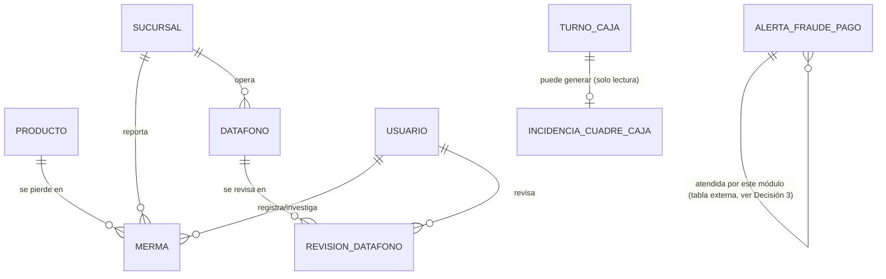

# Modelo de Datos: Prevención de Pérdidas y Seguridad

**Feature**: `006-prevencion-perdidas-seguridad` | **Fecha**: 2026-09-04
**Origen**: `spec.md` (entidades clave) + `research.md` (Decisiones 1-3)

## Diagrama de relaciones

`PRODUCTO` es propiedad de Inventario y Caducidad (`002`); `SUCURSAL` y `USUARIO` de Expansión/Administración; `TURNO_CAJA` y `ALERTA_FRAUDE_PAGO` son propiedad de Ventas y Caja (`001-ventas-y-caja`) — `TURNO_CAJA` se consulta en modo solo lectura, `ALERTA_FRAUDE_PAGO` es la única tabla de otro módulo donde este módulo ejecuta un `UPDATE` (Decisión 3 de `research.md`).

## Tablas

### `merma`

| Campo | Tipo | Restricciones |
|---|---|---|
| id | BIGSERIAL | PK |
| producto_id | BIGINT | NOT NULL, FK → producto |
| sucursal_id | BIGINT | NOT NULL, FK → sucursal |
| cantidad | NUMERIC(10,3) | NOT NULL, CHECK (cantidad > 0) |
| valor_estimado | NUMERIC(10,2) | NOT NULL, CHECK (valor_estimado > 0) |
| causa | TEXT | NULL, CHECK IN ('robo_externo','error_humano','fraude_interno','caducidad') — asignable después de la detección (RF-PP-002) |
| resultado_investigacion | TEXT | NULL, CHECK IN ('confirmada','descartada'), CHECK (resultado_investigacion IS NULL OR causa IS NOT NULL) — RN-PP-001 |
| fecha_deteccion | TIMESTAMPTZ | NOT NULL, DEFAULT now() |
| fecha_resultado | TIMESTAMPTZ | NULL |
| registrado_por | BIGINT | NOT NULL, FK → usuario |
| investigado_por | BIGINT | NULL, FK → usuario |

Índices: `(sucursal_id, fecha_deteccion)`, `(causa)`.

### `incidencia_cuadre_caja`

| Campo | Tipo | Restricciones |
|---|---|---|
| id | BIGSERIAL | PK |
| turno_caja_id | BIGINT | NOT NULL, FK → turno_caja (solo lectura, `001-ventas-y-caja`) |
| score_anomalia | NUMERIC(5,4) | NOT NULL — score del modelo Isolation Forest |
| justificacion | TEXT | NOT NULL, CHECK (length(justificacion) >= 10) — Art. 5.9 |
| estado | TEXT | NOT NULL, DEFAULT 'pendiente', CHECK IN ('pendiente','atendida') |
| fecha_deteccion | TIMESTAMPTZ | NOT NULL, DEFAULT now() |
| atendida_por | BIGINT | NULL, FK → usuario |
| fecha_atencion | TIMESTAMPTZ | NULL |

Restricción adicional: **índice único parcial** `UNIQUE (turno_caja_id) WHERE estado = 'pendiente'` — nunca dos incidencias pendientes del mismo turno (Decisión 1).

Índices: `(sucursal_id derivado de turno_caja, estado)` — resuelto vía join en la consulta, no columna redundante.

### `datafono`

| Campo | Tipo | Restricciones |
|---|---|---|
| id | BIGSERIAL | PK |
| sucursal_id | BIGINT | NOT NULL, FK → sucursal |
| codigo_serie | TEXT | NOT NULL, UNIQUE |
| activo | BOOLEAN | NOT NULL, DEFAULT true |

### `revision_datafono`

| Campo | Tipo | Restricciones |
|---|---|---|
| id | BIGSERIAL | PK |
| datafono_id | BIGINT | NOT NULL, FK → datafono |
| estado | TEXT | NOT NULL, CHECK IN ('actualizado','vencido') |
| observaciones | TEXT | NULL |
| fecha_revision | TIMESTAMPTZ | NOT NULL, DEFAULT now() |
| revisado_por | BIGINT | NOT NULL, FK → usuario |

Índices: `(datafono_id, fecha_revision DESC)` — soporta obtener el estado vigente (Decisión 2).

### `alerta_fraude_pago` (tabla externa — propiedad de `001-ventas-y-caja`)

No se redefine aquí. Este módulo ejecuta únicamente el `UPDATE` de atención sobre las columnas ya definidas en `001-ventas-y-caja/data-model.md` (`estado`, `atendida_en`, `atendida_por`), nunca el `INSERT` inicial (Decisión 3). El servicio de este módulo (`backend/app/services/perdidas.py`) importa el modelo SQLAlchemy de `001` en vez de duplicar su definición.

## Notas de integridad transversales

- `incidencia_cuadre_caja` nunca modifica `turno_caja` — es la única forma en que el modelo de detección de anomalías interactúa con los cuadres de caja (RNF-PP-001).
- `revision_datafono` es estrictamente append-only; el estado vigente de un datáfono siempre se deriva por consulta, nunca se cachea en una columna de `datafono` (RNF-PP-002).
- El `UPDATE` sobre `alerta_fraude_pago` (Decisión 3) es la única escritura cruzada entre módulos de todo el proyecto — cualquier necesidad futura similar debe documentarse con el mismo nivel de detalle, no asumirse por comodidad.
